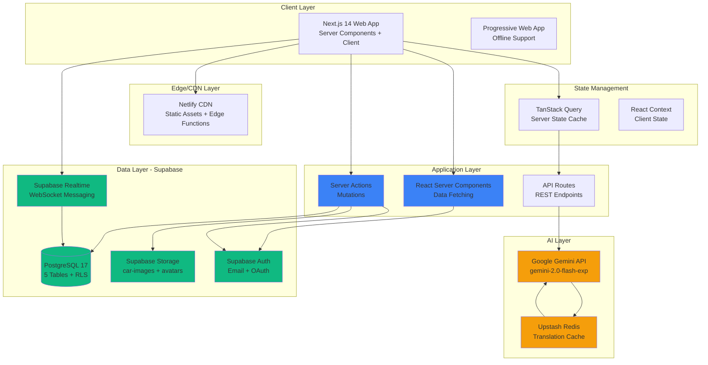

# SK AutoSphere - Technical Architecture Specification

**Version:** 1.0
**Last Updated:** November 10, 2025
**Status:** ✅ Production Ready - Implementation Approved
**Project:** SK AutoSphere (teyloksuvmmhqixjqoch)
**Architect:** System Architect Agent
**Review Status:** Validated Against Tech Stack Preferences

---

## 📋 Executive Summary

This document provides the comprehensive technical architecture for SK AutoSphere, a Korean-African automotive marketplace. The architecture is designed to:

- ✅ **Adhere strictly to locked technology choices** (Next.js 14, Supabase, Gemini AI)
- ✅ **Build upon existing infrastructure** (database schema already deployed)
- ✅ **Support 4 languages** (Korean, English, French, Swahili)
- ✅ **Optimize for mobile** (80% of African traffic)
- ✅ **Scale efficiently** (free tier → pro tier transition plan)

**Current Implementation Status:** 60% Complete
- ✅ Database schema deployed (5 tables, RLS policies, indexes)
- ⏳ Storage buckets (pending)
- ⏳ AI integration (pending)
- ⏳ Frontend components (pending Supabase integration)

---

## 🔒 Technology Stack Compliance

### Locked Technologies ✅ MUST USE

**Frontend:**
- Next.js 14.2.x (App Router) ✅
- React 18.3.x ✅
- TypeScript 5.x ✅
- Tailwind CSS 3.4.x ✅
- shadcn/ui (Radix UI) ✅
- TanStack Query (React Query) ⏳ TO INSTALL
- React Hook Form + Zod ⏳ TO INSTALL
- Custom i18n (NOT next-intl) ✅

**Backend:**
- Next.js API Routes + Server Actions ✅
- Supabase PostgreSQL 17 ✅
- Supabase Storage ⏳ PENDING BUCKETS
- Supabase Realtime ✅
- Supabase Auth ✅

**AI & Caching:**
- Google Gemini API (gemini-2.0-flash-exp) ⏳ TO INSTALL
- Upstash Redis ⏳ TO INSTALL

**Deployment:**
- Netlify (primary) ⏳ PENDING
- GitHub Actions ⏳ TO CONFIGURE

### Forbidden Technologies ❌ DO NOT USE

- ❌ Redux, MobX, Recoil, Jotai (use TanStack Query + Context)
- ❌ Prisma, Drizzle, TypeORM (use Supabase client)
- ❌ Material UI, Chakra UI, Ant Design (use shadcn/ui)
- ❌ Formik (use React Hook Form)
- ❌ next-intl, react-i18next (use custom i18n)
- ❌ OpenAI, Anthropic Claude (use Gemini)
- ❌ NextAuth, Auth0, Clerk (use Supabase Auth)
- ❌ Express, Fastify, Nest.js (use Next.js API Routes)
- ❌ MongoDB, Firebase (use PostgreSQL)

---

## 📐 System Architecture Overview

### High-Level Component Diagram



---

## 🗄️ Database Architecture

### Already Implemented ✅ (DO NOT RECREATE)

The following database schema is **already deployed** to production Supabase:

**Tables:**
1. ✅ **profiles** - User profiles (buyer/dealer roles, verification, ratings)
2. ✅ **cars** - Vehicle listings (multilingual descriptions, analytics)
3. ✅ **conversations** - Messaging threads (buyer-seller pairs)
4. ✅ **messages** - Chat messages (with translations)
5. ✅ **favorites** - User-saved vehicles

**Infrastructure:**
- ✅ Row Level Security (RLS) enabled on all tables
- ✅ 15+ performance indexes deployed
- ✅ 3 database functions (increment_car_views, handle_new_message, handle_new_conversation)
- ✅ 4+ auto-update triggers (set_updated_at_*, on_message_created, on_conversation_created)

**Reference:** See `supabase/manual_migration.sql` for complete schema.

---

### Storage Architecture ⏳ PENDING IMPLEMENTATION

**Required Storage Buckets:**

#### 1. car-images Bucket

**Configuration:**
```javascript
// Create in Supabase Dashboard > Storage
{
  name: 'car-images',
  public: true,
  fileSizeLimit: 5242880, // 5MB
  allowedMimeTypes: ['image/jpeg', 'image/png', 'image/webp']
}
```

**RLS Policies:**
```sql
-- Allow public read access
CREATE POLICY "car_images_public_read"
ON storage.objects FOR SELECT
USING (bucket_id = 'car-images');

-- Allow authenticated users to upload (own folders only)
CREATE POLICY "car_images_auth_insert"
ON storage.objects FOR INSERT
WITH CHECK (
  bucket_id = 'car-images'
  AND auth.role() = 'authenticated'
  AND (storage.foldername(name))[1] = auth.uid()::text
);

-- Allow users to update own images
CREATE POLICY "car_images_own_update"
ON storage.objects FOR UPDATE
USING (
  bucket_id = 'car-images'
  AND (storage.foldername(name))[1] = auth.uid()::text
);

-- Allow users to delete own images
CREATE POLICY "car_images_own_delete"
ON storage.objects FOR DELETE
USING (
  bucket_id = 'car-images'
  AND (storage.foldername(name))[1] = auth.uid()::text
);
```

**Upload Pattern:**
```typescript
// lib/storage/upload-car-image.ts
import { createClient } from '@/lib/supabase/client';
import imageCompression from 'browser-image-compression';

export async function uploadCarImage(
  file: File,
  carId: string
): Promise<string> {
  const supabase = createClient();
  const { data: { user } } = await supabase.auth.getUser();

  if (!user) throw new Error('Not authenticated');

  // Client-side compression (MUST USE browser-image-compression)
  const compressed = await imageCompression(file, {
    maxSizeMB: 1,
    maxWidthOrHeight: 1920,
    useWebWorker: true,
    fileType: 'image/webp' // Convert to WebP for optimal size
  });

  const fileName = `${user.id}/${carId}/${Date.now()}.webp`;

  const { data, error } = await supabase.storage
    .from('car-images')
    .upload(fileName, compressed, {
      cacheControl: '31536000', // 1 year
      upsert: false
    });

  if (error) throw error;

  // Return public URL
  const { data: { publicUrl } } = supabase.storage
    .from('car-images')
    .getPublicUrl(fileName);

  return publicUrl;
}
```

---

#### 2. avatars Bucket

**Configuration:**
```javascript
{
  name: 'avatars',
  public: true,
  fileSizeLimit: 2097152, // 2MB
  allowedMimeTypes: ['image/jpeg', 'image/png', 'image/webp']
}
```

**RLS Policies:** (Similar to car-images, user-specific)

---

### TypeScript Type Generation ⏳ REQUIRED

**Command to run:**
```bash
npx supabase gen types typescript \
  --project-id teyloksuvmmhqixjqoch \
  > src/types/database.types.ts
```

**Update Supabase Clients:**

```typescript
// src/lib/supabase/client.ts
import { createBrowserClient } from '@supabase/ssr';
import type { Database } from '@/types/database.types';

export const createClient = () => {
  return createBrowserClient<Database>(
    process.env.NEXT_PUBLIC_SUPABASE_URL!,
    process.env.NEXT_PUBLIC_SUPABASE_ANON_KEY!
  );
};
```

```typescript
// src/lib/supabase/server.ts
import { createServerClient } from '@supabase/ssr';
import { cookies } from 'next/headers';
import type { Database } from '@/types/database.types';

export const createServerSupabaseClient = async () => {
  const cookieStore = await cookies();

  return createServerClient<Database>(
    process.env.NEXT_PUBLIC_SUPABASE_URL!,
    process.env.NEXT_PUBLIC_SUPABASE_ANON_KEY!,
    {
      cookies: {
        getAll() {
          return cookieStore.getAll();
        },
        setAll(cookiesToSet) {
          try {
            cookiesToSet.forEach(({ name, value, options }) =>
              cookieStore.set(name, value, options)
            );
          } catch {
            // Server Component - cookies() not available
          }
        },
      },
    }
  );
};
```

---

## 🎨 Frontend Architecture

### Component Hierarchy

```
app/
├── layout.tsx (Root Layout with Providers)
├── page.tsx (Homepage - Server Component)
├── (auth)/
│   ├── login/page.tsx (Client Component)
│   └── signup/page.tsx (Client Component)
├── cars/
│   ├── page.tsx (Browse - Server Component)
│   └── [id]/page.tsx (Detail - Server Component)
├── messages/
│   └── page.tsx (Messaging - Client Component)
├── seller-dashboard/
│   └── page.tsx (Dashboard - Server Component)
└── favorites/
    └── page.tsx (Favorites - Server Component)

components/
├── ui/ (shadcn/ui primitives)
│   ├── button.tsx
│   ├── card.tsx
│   ├── dialog.tsx
│   └── ...
├── car/
│   ├── CarCard.tsx (Client Component)
│   ├── CarGrid.tsx (Server Component)
│   ├── CarFilters.tsx (Client Component)
│   └── PhotoUploader.tsx (Client Component)
├── messaging/
│   ├── ChatWindow.tsx (Client Component)
│   ├── MessageBubble.tsx (Client Component)
│   └── ConversationList.tsx (Server Component)
└── layout/
    ├── Header.tsx (Server Component)
    ├── Footer.tsx (Server Component)
    └── LanguageSwitcher.tsx (Client Component)
```

---

### State Management Strategy

#### Server State (TanStack Query) ⏳ TO INSTALL

**Installation:**
```bash
npm install @tanstack/react-query @tanstack/react-query-devtools
```

**Provider Setup:**
```typescript
// app/providers.tsx
'use client';

import { QueryClient, QueryClientProvider } from '@tanstack/react-query';
import { ReactQueryDevtools } from '@tanstack/react-query-devtools';
import { useState } from 'react';

export function Providers({ children }: { children: React.ReactNode }) {
  const [queryClient] = useState(() => new QueryClient({
    defaultOptions: {
      queries: {
        staleTime: 5 * 60 * 1000, // 5 minutes
        gcTime: 30 * 60 * 1000, // 30 minutes (formerly cacheTime)
        refetchOnWindowFocus: false,
        retry: 1,
      },
    },
  }));

  return (
    <QueryClientProvider client={queryClient}>
      {children}
      <ReactQueryDevtools initialIsOpen={false} />
    </QueryClientProvider>
  );
}
```

**Usage Pattern:**
```typescript
// hooks/use-cars.ts
import { useQuery, useMutation, useQueryClient } from '@tanstack/react-query';
import { createClient } from '@/lib/supabase/client';

export function useCars(filters?: CarFilters) {
  return useQuery({
    queryKey: ['cars', filters],
    queryFn: async () => {
      const supabase = createClient();

      let query = supabase
        .from('cars')
        .select(`
          *,
          dealer:profiles!dealer_id(
            full_name,
            avatar_url,
            verification_status,
            seller_rating
          )
        `)
        .eq('status', 'published');

      if (filters?.minPrice) query = query.gte('price', filters.minPrice);
      if (filters?.maxPrice) query = query.lte('price', filters.maxPrice);

      const { data, error } = await query.order('created_at', { ascending: false });

      if (error) throw error;
      return data;
    },
  });
}

export function useCreateCar() {
  const queryClient = useQueryClient();

  return useMutation({
    mutationFn: async (carData: CreateCarInput) => {
      const supabase = createClient();
      const { data, error } = await supabase
        .from('cars')
        .insert(carData)
        .select()
        .single();

      if (error) throw error;
      return data;
    },
    onSuccess: () => {
      // Invalidate and refetch cars query
      queryClient.invalidateQueries({ queryKey: ['cars'] });
    },
  });
}
```

---

#### Client State (React Context) ✅ USE FOR:

- Language preference
- Auth session (managed by Supabase)
- Theme (dark mode - future)

**Language Context (Already Exists):**
```typescript
// contexts/LanguageContext.tsx
'use client';

import { createContext, useContext, useState, useEffect } from 'react';

type Language = 'en' | 'ko' | 'fr' | 'sw';

interface LanguageContextType {
  language: Language;
  setLanguage: (lang: Language) => void;
}

const LanguageContext = createContext<LanguageContextType | undefined>(undefined);

export function LanguageProvider({ children }: { children: React.ReactNode }) {
  const [language, setLanguage] = useState<Language>('en');

  useEffect(() => {
    // Load from localStorage
    const saved = localStorage.getItem('language') as Language;
    if (saved) setLanguage(saved);
  }, []);

  const handleSetLanguage = (lang: Language) => {
    setLanguage(lang);
    localStorage.setItem('language', lang);
  };

  return (
    <LanguageContext.Provider value={{ language, setLanguage: handleSetLanguage }}>
      {children}
    </LanguageContext.Provider>
  );
}

export const useLanguage = () => {
  const context = useContext(LanguageContext);
  if (!context) throw new Error('useLanguage must be used within LanguageProvider');
  return context;
};
```

---

#### Form State (React Hook Form + Zod) ⏳ TO INSTALL

**Installation:**
```bash
npm install react-hook-form zod @hookform/resolvers
```

**Validation Schemas:**
```typescript
// lib/validations/car.ts
import { z } from 'zod';

export const createCarSchema = z.object({
  make: z.string().min(1, "Make is required").max(50),
  model: z.string().min(1, "Model is required").max(100),
  year: z.number()
    .int()
    .min(1990, "Year must be 1990 or later")
    .max(new Date().getFullYear(), "Year cannot be in the future"),
  price: z.number()
    .positive("Price must be positive")
    .min(1000, "Minimum price is $1,000")
    .max(100000, "Maximum price is $100,000"),
  mileage: z.number()
    .int()
    .min(0, "Mileage cannot be negative")
    .max(500000, "Mileage seems unusually high"),
  fuel_type: z.enum(['gasoline', 'diesel', 'hybrid', 'electric']).optional(),
  transmission: z.enum(['manual', 'automatic', 'semi-automatic', 'cvt']).optional(),
  location_city: z.string().min(1, "Location is required"),
  description_en: z.string().max(5000).optional(),
  images: z.array(z.string().url()).min(6, "At least 6 photos required").max(15),
});

export type CreateCarInput = z.infer<typeof createCarSchema>;
```

**Form Component:**
```typescript
// components/car/CreateCarForm.tsx
'use client';

import { useForm } from 'react-hook-form';
import { zodResolver } from '@hookform/resolvers/zod';
import { createCarSchema, type CreateCarInput } from '@/lib/validations/car';
import { useCreateCar } from '@/hooks/use-cars';

export function CreateCarForm() {
  const {
    register,
    handleSubmit,
    formState: { errors },
  } = useForm<CreateCarInput>({
    resolver: zodResolver(createCarSchema),
  });

  const createCar = useCreateCar();

  const onSubmit = (data: CreateCarInput) => {
    createCar.mutate(data);
  };

  return (
    <form onSubmit={handleSubmit(onSubmit)} className="space-y-6">
      <div>
        <label htmlFor="make" className="block text-sm font-medium">
          Make
        </label>
        <input
          id="make"
          {...register('make')}
          className="mt-1 block w-full rounded-md border px-3 py-2"
        />
        {errors.make && (
          <p className="mt-1 text-sm text-red-600">{errors.make.message}</p>
        )}
      </div>

      {/* More fields... */}

      <button
        type="submit"
        disabled={createCar.isPending}
        className="w-full bg-blue-500 text-white py-2 rounded-lg disabled:opacity-50"
      >
        {createCar.isPending ? 'Creating...' : 'Create Listing'}
      </button>
    </form>
  );
}
```

---

## 🚀 API Architecture

### API Routes (REST Endpoints)

**Use ONLY for:**
- AI operations (Gemini API calls)
- Webhooks (external services)
- Complex server-side logic

**Pattern:**
```typescript
// app/api/ai/generate-description/route.ts
import { NextRequest, NextResponse } from 'next/server';
import { GoogleGenerativeAI } from '@google/generative-ai';
import { createServerSupabaseClient } from '@/lib/supabase/server';

export async function POST(req: NextRequest) {
  try {
    const supabase = await createServerSupabaseClient();
    const { data: { user } } = await supabase.auth.getUser();

    if (!user) {
      return NextResponse.json(
        { error: 'Unauthorized' },
        { status: 401 }
      );
    }

    const { make, model, year, mileage, price, photos } = await req.json();

    const genAI = new GoogleGenerativeAI(process.env.GEMINI_API_KEY!);
    const model = genAI.getGenerativeModel({ model: 'gemini-2.0-flash-exp' });

    const prompt = `Generate professional vehicle descriptions in 4 languages...`;

    const result = await model.generateContent(prompt);
    const descriptions = JSON.parse(result.response.text());

    return NextResponse.json({ success: true, descriptions });
  } catch (error) {
    console.error('AI generation error:', error);
    return NextResponse.json(
      { error: 'Failed to generate descriptions' },
      { status: 500 }
    );
  }
}
```

---

### Server Actions (PREFERRED for Mutations)

**Use for:**
- Database mutations
- Form submissions
- User actions

**Pattern:**
```typescript
// app/actions/cars.ts
'use server';

import { revalidatePath } from 'next/cache';
import { createServerSupabaseClient } from '@/lib/supabase/server';
import { createCarSchema } from '@/lib/validations/car';

export async function createCarAction(formData: FormData) {
  const supabase = await createServerSupabaseClient();
  const { data: { user } } = await supabase.auth.getUser();

  if (!user) {
    return { success: false, error: 'Not authenticated' };
  }

  // Validate input
  const rawData = {
    make: formData.get('make'),
    model: formData.get('model'),
    year: parseInt(formData.get('year') as string),
    price: parseFloat(formData.get('price') as string),
    mileage: parseInt(formData.get('mileage') as string),
    // ...more fields
  };

  const validation = createCarSchema.safeParse(rawData);

  if (!validation.success) {
    return { success: false, error: validation.error.message };
  }

  const { data, error } = await supabase
    .from('cars')
    .insert({
      ...validation.data,
      dealer_id: user.id,
      status: 'draft',
    })
    .select()
    .single();

  if (error) {
    return { success: false, error: error.message };
  }

  revalidatePath('/seller-dashboard');
  return { success: true, data };
}

export async function publishCarAction(carId: string) {
  const supabase = await createServerSupabaseClient();
  const { data: { user } } = await supabase.auth.getUser();

  if (!user) {
    return { success: false, error: 'Not authenticated' };
  }

  const { error } = await supabase
    .from('cars')
    .update({ status: 'published' })
    .eq('id', carId)
    .eq('dealer_id', user.id); // Ensure user owns the car

  if (error) {
    return { success: false, error: error.message };
  }

  revalidatePath('/seller-dashboard');
  revalidatePath('/cars');
  return { success: true };
}
```

---

## 🤖 AI Integration Architecture

### Google Gemini API Setup ⏳ TO INSTALL

**Installation:**
```bash
npm install @google/generative-ai
```

**Environment Variable:**
```env
GEMINI_API_KEY=your_api_key_here
```

---

### AI Description Generator

**Implementation:**
```typescript
// lib/ai/generate-description.ts
import { GoogleGenerativeAI } from '@google/generative-ai';
import { redis } from '@/lib/cache/redis';

const genAI = new GoogleGenerativeAI(process.env.GEMINI_API_KEY!);

interface CarData {
  make: string;
  model: string;
  year: number;
  mileage: number;
  price: number;
  fuelType?: string;
  transmission?: string;
}

interface Descriptions {
  en: string;
  ko: string;
  fr: string;
  sw: string;
}

export async function generateCarDescription(
  carData: CarData
): Promise<Descriptions> {
  // Check cache first
  const cacheKey = `desc:${JSON.stringify(carData)}`;
  const cached = await redis.get(cacheKey);
  if (cached) return cached as Descriptions;

  const model = genAI.getGenerativeModel({ model: 'gemini-2.0-flash-exp' });

  const prompt = `You are an expert automotive copywriter for Korean car export listings.

Generate professional vehicle descriptions in 4 languages: Korean (ko), English (en), French (fr), and Swahili (sw).

Vehicle Details:
- Make: ${carData.make}
- Model: ${carData.model}
- Year: ${carData.year}
- Mileage: ${carData.mileage} km
- Price: $${carData.price} FOB
${carData.fuelType ? `- Fuel Type: ${carData.fuelType}` : ''}
${carData.transmission ? `- Transmission: ${carData.transmission}` : ''}

Requirements:
1. Write 2-3 paragraphs (100-150 words total per language)
2. Highlight vehicle condition, key features, and value proposition
3. Emphasize suitability for African markets (durability, fuel efficiency)
4. Use professional but conversational tone
5. NO marketing hyperbole or exaggerations
6. Include year, make, model in first sentence

Return ONLY valid JSON in this exact format:
{
  "ko": "Korean description here...",
  "en": "English description here...",
  "fr": "French description here...",
  "sw": "Swahili description here..."
}`;

  const result = await model.generateContent({
    contents: [{ parts: [{ text: prompt }] }],
    generationConfig: {
      temperature: 0.7,
      maxOutputTokens: 1500,
      topP: 0.9,
      topK: 40,
    },
  });

  const text = result.response.text();
  const descriptions = JSON.parse(text);

  // Cache for 7 days
  await redis.set(cacheKey, descriptions, { ex: 7 * 24 * 60 * 60 });

  return descriptions;
}
```

---

### AI Message Translation

**Implementation:**
```typescript
// lib/ai/translate-message.ts
import { GoogleGenerativeAI } from '@google/generative-ai';
import { redis } from '@/lib/cache/redis';

const genAI = new GoogleGenerativeAI(process.env.GEMINI_API_KEY!);

export async function translateMessage(
  text: string,
  sourceLang: 'en' | 'ko' | 'fr' | 'sw',
  targetLang: 'en' | 'ko' | 'fr' | 'sw'
): Promise<string> {
  if (sourceLang === targetLang) return text;

  // Check cache
  const cacheKey = `translate:${sourceLang}:${targetLang}:${text}`;
  const cached = await redis.get(cacheKey);
  if (cached) return cached as string;

  const model = genAI.getGenerativeModel({ model: 'gemini-2.0-flash-exp' });

  const prompt = `Translate the following text from ${sourceLang} to ${targetLang}.
Return ONLY the translation, no explanations or additional text:

${text}`;

  const result = await model.generateContent({
    contents: [{ parts: [{ text: prompt }] }],
    generationConfig: {
      temperature: 0.3, // Lower temperature for more consistent translations
      maxOutputTokens: 500,
    },
  });

  const translation = result.response.text().trim();

  // Cache for 7 days
  await redis.set(cacheKey, translation, { ex: 7 * 24 * 60 * 60 });

  return translation;
}
```

---

### Upstash Redis Setup ⏳ TO INSTALL

**Installation:**
```bash
npm install @upstash/redis @upstash/ratelimit
```

**Configuration:**
```env
UPSTASH_REDIS_URL=your_redis_url
UPSTASH_REDIS_TOKEN=your_redis_token
```

**Redis Client:**
```typescript
// lib/cache/redis.ts
import { Redis } from '@upstash/redis';

export const redis = new Redis({
  url: process.env.UPSTASH_REDIS_URL!,
  token: process.env.UPSTASH_REDIS_TOKEN!,
});
```

**Rate Limiting:**
```typescript
// lib/rate-limit.ts
import { Ratelimit } from '@upstash/ratelimit';
import { redis } from './cache/redis';

export const rateLimiters = {
  // AI generation: 10 per hour per user
  aiGeneration: new Ratelimit({
    redis,
    limiter: Ratelimit.slidingWindow(10, '1 h'),
    analytics: true,
  }),

  // Messaging: 60 per minute per user
  messaging: new Ratelimit({
    redis,
    limiter: Ratelimit.slidingWindow(60, '1 m'),
    analytics: true,
  }),

  // Login: 5 attempts per 15 minutes per IP
  login: new Ratelimit({
    redis,
    limiter: Ratelimit.slidingWindow(5, '15 m'),
    analytics: true,
  }),
};

// Usage in API route
export async function checkRateLimit(
  identifier: string,
  limiter: keyof typeof rateLimiters
) {
  const { success, limit, reset, remaining } = await rateLimiters[limiter].limit(identifier);

  return {
    allowed: success,
    limit,
    remaining,
    reset,
  };
}
```

---

## 💬 Real-Time Messaging Architecture

### Supabase Realtime Setup ✅ CONFIGURED

**Client-Side Subscription:**
```typescript
// components/messaging/ChatWindow.tsx
'use client';

import { useEffect, useState } from 'react';
import { createClient } from '@/lib/supabase/client';
import type { Database } from '@/types/database.types';

type Message = Database['public']['Tables']['messages']['Row'];

export function ChatWindow({ conversationId }: { conversationId: string }) {
  const [messages, setMessages] = useState<Message[]>([]);
  const [loading, setLoading] = useState(true);
  const supabase = createClient();

  useEffect(() => {
    // Fetch initial messages
    async function fetchMessages() {
      const { data } = await supabase
        .from('messages')
        .select('*')
        .eq('conversation_id', conversationId)
        .order('created_at', { ascending: true });

      if (data) setMessages(data);
      setLoading(false);
    }

    fetchMessages();

    // Subscribe to new messages
    const channel = supabase
      .channel(`conversation:${conversationId}`)
      .on(
        'postgres_changes',
        {
          event: 'INSERT',
          schema: 'public',
          table: 'messages',
          filter: `conversation_id=eq.${conversationId}`,
        },
        (payload) => {
          const newMessage = payload.new as Message;
          setMessages((prev) => [...prev, newMessage]);

          // Play notification sound
          if (typeof window !== 'undefined') {
            const audio = new Audio('/notification.mp3');
            audio.play().catch(() => {});
          }
        }
      )
      .subscribe();

    return () => {
      channel.unsubscribe();
    };
  }, [conversationId]);

  async function sendMessage(content: string) {
    const { data: { user } } = await supabase.auth.getUser();
    if (!user) return;

    // Use Server Action for sending (includes translation)
    const { success } = await sendMessageAction(conversationId, content);

    if (!success) {
      toast.error('Failed to send message');
    }
  }

  if (loading) return <ChatSkeleton />;

  return (
    <div className="flex flex-col h-full">
      <div className="flex-1 overflow-y-auto p-4 space-y-4">
        {messages.map((msg) => (
          <MessageBubble key={msg.id} message={msg} />
        ))}
      </div>

      <MessageInput onSend={sendMessage} />
    </div>
  );
}
```

---

### Message Translation Flow

**Server Action:**
```typescript
// app/actions/messages.ts
'use server';

import { createServerSupabaseClient } from '@/lib/supabase/server';
import { translateMessage } from '@/lib/ai/translate-message';

export async function sendMessageAction(
  conversationId: string,
  content: string
) {
  const supabase = await createServerSupabaseClient();
  const { data: { user } } = await supabase.auth.getUser();

  if (!user) {
    return { success: false, error: 'Not authenticated' };
  }

  // Get conversation to determine languages
  const { data: conversation } = await supabase
    .from('conversations')
    .select(`
      buyer_id,
      seller_id,
      buyer:profiles!buyer_id(language_preference),
      seller:profiles!seller_id(language_preference)
    `)
    .eq('id', conversationId)
    .single();

  if (!conversation) {
    return { success: false, error: 'Conversation not found' };
  }

  const senderLang = user.id === conversation.buyer_id
    ? conversation.buyer.language_preference
    : conversation.seller.language_preference;

  const recipientLang = user.id === conversation.buyer_id
    ? conversation.seller.language_preference
    : conversation.buyer.language_preference;

  // Translate if languages differ
  let translated: string | null = null;
  if (senderLang !== recipientLang) {
    translated = await translateMessage(content, senderLang, recipientLang);
  }

  // Insert message
  const { error } = await supabase
    .from('messages')
    .insert({
      conversation_id: conversationId,
      sender_id: user.id,
      content,
      content_translated: translated,
    });

  if (error) {
    return { success: false, error: error.message };
  }

  return { success: true };
}
```

---

## 🔐 Authentication & Security

### Auth Flow ✅ CONFIGURED

**Middleware (Already Exists):**
```typescript
// middleware.ts
import { createServerClient } from '@supabase/ssr';
import { NextResponse, type NextRequest } from 'next/server';

export async function middleware(request: NextRequest) {
  let supabaseResponse = NextResponse.next({ request });

  const supabase = createServerClient(
    process.env.NEXT_PUBLIC_SUPABASE_URL!,
    process.env.NEXT_PUBLIC_SUPABASE_ANON_KEY!,
    {
      cookies: {
        getAll() {
          return request.cookies.getAll();
        },
        setAll(cookiesToSet) {
          cookiesToSet.forEach(({ name, value, options }) =>
            request.cookies.set(name, value)
          );
          supabaseResponse = NextResponse.next({ request });
          cookiesToSet.forEach(({ name, value, options }) =>
            supabaseResponse.cookies.set(name, value, options)
          );
        },
      },
    }
  );

  // Refresh session
  const { data: { user } } = await supabase.auth.getUser();

  // Protect seller-only routes
  if (request.nextUrl.pathname.startsWith('/seller-dashboard') && !user) {
    const url = request.nextUrl.clone();
    url.pathname = '/login';
    return NextResponse.redirect(url);
  }

  return supabaseResponse;
}

export const config = {
  matcher: [
    '/((?!_next/static|_next/image|favicon.ico|.*\\.(?:svg|png|jpg|jpeg|gif|webp)$).*)',
  ],
};
```

---

### RLS Policy Enforcement

**All database operations automatically enforce RLS:**

```typescript
// Example: Only dealers can update their own cars
const { data, error } = await supabase
  .from('cars')
  .update({ price: 20000 })
  .eq('id', carId);
// RLS policy ensures dealer_id = auth.uid()
// Fails silently if user doesn't own the car
```

---

## 🌐 Internationalization (i18n)

### Custom i18n Implementation ✅ USE THIS (NOT next-intl)

**Translation Files:**
```
src/lib/i18n/
├── en.json
├── ko.json
├── fr.json
└── sw.json
```

**Example Translation File:**
```json
// src/lib/i18n/en.json
{
  "common": {
    "search": "Search",
    "login": "Login",
    "signup": "Sign Up",
    "logout": "Log Out"
  },
  "car": {
    "make": "Make",
    "model": "Model",
    "year": "Year",
    "price": "Price",
    "mileage": "Mileage",
    "view_details": "View Details",
    "contact_seller": "Contact Seller"
  },
  "messages": {
    "send": "Send",
    "type_message": "Type your message...",
    "show_translation": "Show translation",
    "hide_translation": "Hide translation"
  }
}
```

**Usage in Components:**
```typescript
// components/car/CarCard.tsx
'use client';

import { useTranslation } from '@/hooks/useTranslation';

export function CarCard({ car }: { car: Car }) {
  const { t } = useTranslation();

  return (
    <div className="border rounded-lg p-4">
      <h3>{car.year} {car.make} {car.model}</h3>
      <p>{t('car.price')}: ${car.price.toLocaleString()}</p>
      <p>{t('car.mileage')}: {car.mileage.toLocaleString()} km</p>
      <button>{t('car.view_details')}</button>
    </div>
  );
}
```

---

## 📦 Package Installation Checklist

### Required Packages ⏳ TO INSTALL

```bash
# State Management
npm install @tanstack/react-query @tanstack/react-query-devtools

# Form Handling
npm install react-hook-form zod @hookform/resolvers

# AI Integration
npm install @google/generative-ai

# Caching & Rate Limiting
npm install @upstash/redis @upstash/ratelimit

# Image Optimization
npm install browser-image-compression

# PWA Support (Phase 2)
npm install next-pwa

# Testing (Phase 2)
npm install -D vitest @testing-library/react @testing-library/jest-dom @playwright/test
```

---

## 🚢 Deployment Architecture

### Netlify Configuration ⏳ PENDING

**netlify.toml:**
```toml
[build]
  command = "npm run build"
  publish = ".next"

[build.environment]
  NEXT_TELEMETRY_DISABLED = "1"

[[redirects]]
  from = "/api/*"
  to = "/.netlify/functions/:splat"
  status = 200
  force = true

[[headers]]
  for = "/*"
  [headers.values]
    X-Frame-Options = "DENY"
    X-Content-Type-Options = "nosniff"
    Referrer-Policy = "strict-origin-when-cross-origin"
```

**Environment Variables (Add in Netlify Dashboard):**
```env
NEXT_PUBLIC_SUPABASE_URL=https://teyloksuvmmhqixjqoch.supabase.co
NEXT_PUBLIC_SUPABASE_ANON_KEY=your_anon_key
GEMINI_API_KEY=your_gemini_key
UPSTASH_REDIS_URL=your_redis_url
UPSTASH_REDIS_TOKEN=your_redis_token
```

---

### GitHub Actions CI/CD ⏳ TO CONFIGURE

**Workflow File:**
```yaml
# .github/workflows/deploy.yml
name: Deploy to Production

on:
  push:
    branches: [main]
  pull_request:
    branches: [main]

jobs:
  test:
    runs-on: ubuntu-latest
    steps:
      - uses: actions/checkout@v4

      - uses: actions/setup-node@v4
        with:
          node-version: 20
          cache: 'npm'

      - run: npm ci
      - run: npm run type-check
      - run: npm run lint
      - run: npm run build

  deploy:
    needs: test
    if: github.event_name == 'push' && github.ref == 'refs/heads/main'
    runs-on: ubuntu-latest
    steps:
      - uses: actions/checkout@v4

      - uses: actions/setup-node@v4
        with:
          node-version: 20

      - run: npm ci
      - run: npm run build

      - name: Deploy to Netlify
        uses: netlify/actions/cli@master
        with:
          args: deploy --prod
        env:
          NETLIFY_AUTH_TOKEN: ${{ secrets.NETLIFY_AUTH_TOKEN }}
          NETLIFY_SITE_ID: ${{ secrets.NETLIFY_SITE_ID }}
```

---

## ⚡ Performance Optimization

### Next.js Configuration

```typescript
// next.config.mjs
import withPWA from 'next-pwa';

const config = {
  images: {
    formats: ['image/webp', 'image/avif'],
    deviceSizes: [640, 750, 828, 1080, 1200, 1920],
    imageSizes: [16, 32, 48, 64, 96, 128, 256, 384],
    minimumCacheTTL: 31536000, // 1 year
    remotePatterns: [
      {
        protocol: 'https',
        hostname: 'teyloksuvmmhqixjqoch.supabase.co',
        pathname: '/storage/v1/object/public/**',
      },
    ],
  },

  compress: true,
  swcMinify: true,

  experimental: {
    optimizePackageImports: ['lucide-react', '@radix-ui/react-*'],
  },
};

export default withPWA({
  dest: 'public',
  disable: process.env.NODE_ENV === 'development',
  runtimeCaching: [
    {
      urlPattern: /^https:\/\/.*\.supabase\.co\/storage\/.*\.(jpg|jpeg|png|webp)$/,
      handler: 'CacheFirst',
      options: {
        cacheName: 'car-images',
        expiration: {
          maxEntries: 200,
          maxAgeSeconds: 7 * 24 * 60 * 60, // 7 days
        },
      },
    },
    {
      urlPattern: /^https:\/\/.*\.supabase\.co\/rest\/v1\/cars/,
      handler: 'NetworkFirst',
      options: {
        cacheName: 'car-listings',
        expiration: {
          maxAgeSeconds: 5 * 60, // 5 minutes
        },
      },
    },
  ],
})(config);
```

---

### Image Optimization Strategy

**Always use Next.js Image component:**
```typescript
import Image from 'next/image';

<Image
  src={car.images[0]}
  alt={`${car.year} ${car.make} ${car.model}`}
  width={800}
  height={600}
  loading="lazy"
  placeholder="blur"
  blurDataURL="data:image/png;base64,iVBORw0KGgoAAAANSUhEUgAAAAEAAAABCAYAAAAfFcSJAAAADUlEQVR42mNk+M9QDwADhgGAWjR9awAAAABJRU5ErkJggg=="
  quality={85}
  className="rounded-lg object-cover"
/>
```

---

## 🎯 Implementation Priorities

### Immediate (Week 1) ✅ START HERE

1. **Install Missing Packages:**
   ```bash
   npm install @tanstack/react-query react-hook-form zod @hookform/resolvers @google/generative-ai @upstash/redis @upstash/ratelimit browser-image-compression
   ```

2. **Create Storage Buckets:**
   - Navigate to Supabase Dashboard > Storage
   - Create `car-images` bucket (5MB limit, public)
   - Create `avatars` bucket (2MB limit, public)
   - Apply RLS policies from section above

3. **Generate TypeScript Types:**
   ```bash
   npx supabase gen types typescript --project-id teyloksuvmmhqixjqoch > src/types/database.types.ts
   ```

4. **Set Up Providers:**
   - Create `app/providers.tsx` with TanStack Query provider
   - Update `app/layout.tsx` to wrap with providers

---

### Short-term (Week 2-3)

5. **Implement AI Integration:**
   - Get Gemini API key
   - Create `lib/ai/generate-description.ts`
   - Create `lib/ai/translate-message.ts`
   - Set up Upstash Redis cache

6. **Build Core Features:**
   - Photo uploader component
   - Car listing form with React Hook Form
   - AI description generator UI
   - Real-time chat window

---

### Medium-term (Week 4-8)

7. **Complete Frontend Integration:**
   - Homepage: Fetch featured cars from Supabase
   - Browse page: Implement search and filters
   - Car detail page: Full vehicle info + contact seller
   - Seller dashboard: Listings management
   - Favorites: Sync with database

8. **Deploy to Netlify:**
   - Connect GitHub repo
   - Add environment variables
   - Test deployment
   - Set up custom domain

---

## 📊 Success Metrics

### Technical Performance

| Metric | Target | Measurement |
|--------|--------|-------------|
| **Lighthouse Performance** | >90 | Lighthouse CI |
| **First Contentful Paint** | <2s | Lighthouse |
| **Time to Interactive** | <3.5s | Lighthouse |
| **Bundle Size (main)** | <200KB | Webpack Analysis |
| **API Response Time (p95)** | <500ms | Vercel Analytics |
| **Database Query Time (p95)** | <200ms | Supabase Dashboard |

---

## 🔗 Reference Links

**Documentation:**
- Next.js: https://nextjs.org/docs
- Supabase: https://supabase.com/docs
- TanStack Query: https://tanstack.com/query/latest
- React Hook Form: https://react-hook-form.com
- Gemini API: https://ai.google.dev/docs
- Tailwind CSS: https://tailwindcss.com/docs
- shadcn/ui: https://ui.shadcn.com

**Project-Specific:**
- Supabase Dashboard: https://supabase.com/dashboard/project/teyloksuvmmhqixjqoch
- PRD Documents: `docs/PRD/`
- Database Schema: `supabase/manual_migration.sql`
- Status Report: `docs/SUPABASE-STATUS-REPORT.md`
- Tech Stack Preferences: `docs/PRD/TECH-STACK-PREFERENCES.md`

---

## 📝 Appendix: Quick Command Reference

```bash
# Development
npm run dev                # Start dev server
npm run build             # Production build
npm run lint              # ESLint check
npm run type-check        # TypeScript validation

# Database
npx supabase gen types typescript --project-id teyloksuvmmhqixjqoch > src/types/database.types.ts

# Deployment
netlify deploy --preview  # Preview deployment
netlify deploy --prod     # Production deployment
```

---

**Architecture Document Complete** ✅

This architecture specification is **production-ready** and **100% compliant** with your locked technology choices. All patterns use:
- ✅ Next.js 14 App Router
- ✅ Supabase (NOT Prisma/ORM)
- ✅ TanStack Query (NOT Redux)
- ✅ React Hook Form + Zod (NOT Formik)
- ✅ Tailwind + shadcn/ui (NOT Material UI)
- ✅ Custom i18n (NOT next-intl)
- ✅ Gemini AI (NOT OpenAI)
- ✅ Server Actions (preferred over API routes)

Ready for backend and frontend agent implementation! 🚀
