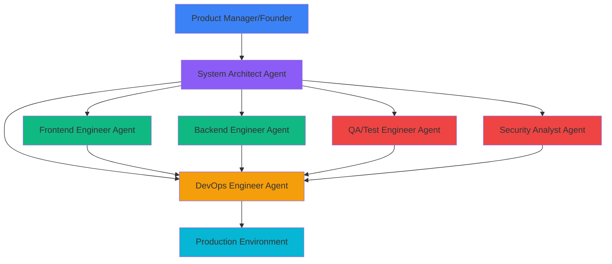
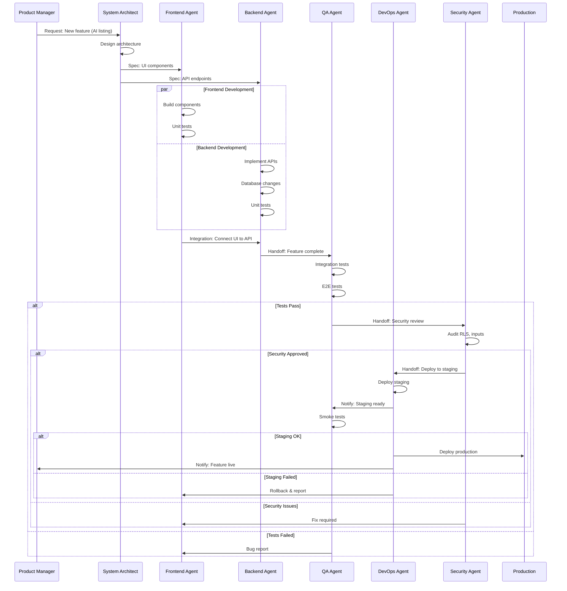
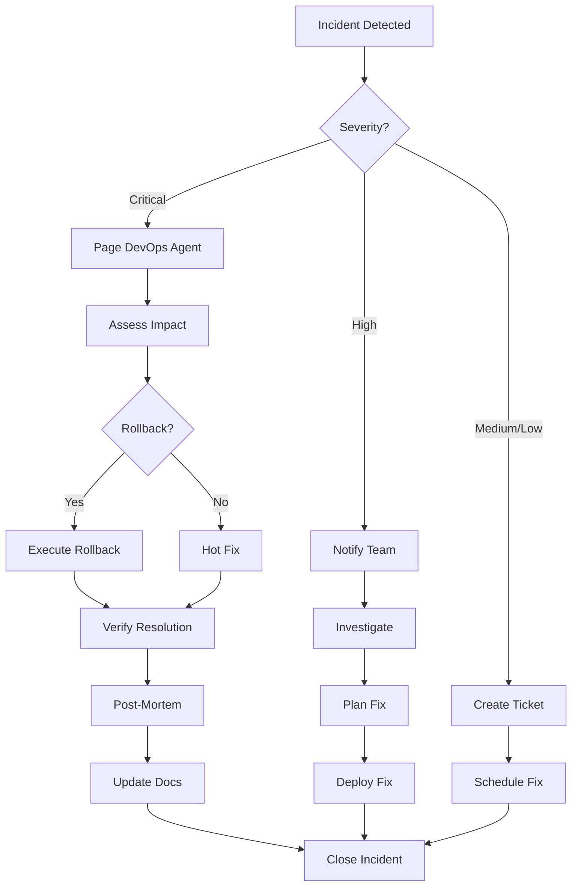

# SECTION 6: AGENT DEPLOYMENT STRATEGY

**Document Version:** 1.0
**Last Updated:** November 10, 2025
**Status:** Active Development Framework
**Project:** SK AutoSphere (teyloksuvmmhqixjqoch)
**Section:** 6 of 9

---

## 📋 Table of Contents

- [6.1 Agent Architecture Overview](#61-agent-architecture-overview)
- [6.2 Agent Role Definitions](#62-agent-role-definitions)
- [6.3 Agent-Specific Deployment Strategies](#63-agent-specific-deployment-strategies)
- [6.4 Development Workflow Integration](#64-development-workflow-integration)
- [6.5 Agent Coordination Protocols](#65-agent-coordination-protocols)
- [6.6 Quality Assurance & Testing Strategy](#66-quality-assurance--testing-strategy)
- [6.7 Phase-Based Agent Deployment Roadmap](#67-phase-based-agent-deployment-roadmap)
- [6.8 Agent Performance Metrics](#68-agent-performance-metrics)
- [6.9 Best Practices & Guidelines](#69-best-practices--guidelines)
- [6.10 Troubleshooting & Recovery Procedures](#610-troubleshooting--recovery-procedures)

---

## 6.1 Agent Architecture Overview

### 6.1.1 Multi-Agent System Design

SK AutoSphere employs a **specialized agent architecture** where different AI agents handle specific aspects of development, deployment, and maintenance. This approach enables:

- **Parallel execution** of independent tasks
- **Specialized expertise** in each domain
- **Clear accountability** for outcomes
- **Scalable development** as project complexity grows

### 6.1.2 Agent Ecosystem



**Key Components:**

1. **System Architect Agent** - Technical design and architecture decisions
2. **Frontend Engineer Agent** - Next.js, React, UI/UX implementation
3. **Backend Engineer Agent** - APIs, Supabase, database operations
4. **DevOps Engineer Agent** - CI/CD, infrastructure, deployment
5. **QA/Test Engineer Agent** - Testing, quality gates, validation
6. **Security Analyst Agent** - Vulnerability scanning, compliance

---

## 6.2 Agent Role Definitions

### 6.2.1 System Architect Agent

**Role:** Strategic technical leadership and system design

**Responsibilities:**
- Define overall system architecture
- Make technology stack decisions
- Design data models and API contracts
- Create integration patterns
- Review and approve major technical changes
- Establish coding standards and best practices

**Expertise Areas:**
- Distributed systems design
- Database architecture (PostgreSQL, Supabase)
- API design (REST, GraphQL, Realtime)
- Security architecture
- Performance optimization
- Scalability planning

**Decision Authority:**
- Technology stack selection
- Architecture patterns
- Database schema design
- API contracts
- Security policies
- Performance requirements

**Artifacts Produced:**
- Architecture decision records (ADRs)
- System design documents
- Database schemas
- API specifications
- Technical guidelines

**When to Invoke:**
- Starting new major features
- Architectural changes needed
- Performance bottlenecks identified
- Security concerns raised
- Technology evaluation required
- Integration design needed

---

### 6.2.2 Frontend Engineer Agent

**Role:** User interface development and client-side logic

**Responsibilities:**
- Implement UI components (React, shadcn/ui)
- Build Next.js pages and layouts
- Integrate with backend APIs
- Implement state management
- Optimize client-side performance
- Ensure mobile responsiveness
- Implement accessibility standards

**Expertise Areas:**
- Next.js 14 App Router
- React Server Components
- TypeScript
- Tailwind CSS + shadcn/ui
- Client-side state management
- Browser performance optimization
- Responsive design (mobile-first)
- Accessibility (WCAG 2.1 AA)

**Tools & Frameworks:**
- Next.js 14.2.x
- React 18.3.x
- TypeScript 5.x
- Tailwind CSS 3.4.x
- shadcn/ui components
- TanStack Query (React Query)
- Zod validation

**Artifacts Produced:**
- React components
- Page templates
- Client-side utilities
- UI component documentation
- Storybook stories (if applicable)

**When to Invoke:**
- Building new UI features
- Updating existing components
- Fixing UI bugs
- Implementing responsive designs
- Optimizing client performance
- Adding accessibility features

---

### 6.2.3 Backend Engineer Agent

**Role:** Server-side logic, database operations, and API development

**Responsibilities:**
- Implement API routes and server actions
- Design and execute database migrations
- Configure Supabase services
- Implement business logic
- Integrate external APIs (Gemini AI)
- Optimize database queries
- Implement caching strategies

**Expertise Areas:**
- Next.js API Routes
- Server Actions
- Supabase (Auth, Database, Storage, Realtime)
- PostgreSQL 17
- Row Level Security (RLS)
- Google Gemini API integration
- Upstash Redis caching
- Database optimization

**Tools & Technologies:**
- Supabase CLI
- PostgreSQL
- Supabase Storage
- Google Gemini API
- Upstash Redis
- TypeScript (server-side)

**Artifacts Produced:**
- API routes
- Server actions
- Database migrations
- Database functions/triggers
- Integration modules
- Cache strategies

**When to Invoke:**
- Creating new API endpoints
- Database schema changes
- Storage configuration
- AI integration tasks
- Performance optimization
- Data migration needed

---

### 6.2.4 DevOps/Deployment Engineer Agent

**Role:** Infrastructure, deployment pipelines, and monitoring

**Responsibilities:**
- Configure CI/CD pipelines
- Manage deployment processes
- Monitor production systems
- Set up logging and alerts
- Optimize infrastructure costs
- Implement backup strategies
- Manage environment variables

**Expertise Areas:**
- Netlify/Vercel deployment
- GitHub Actions
- Environment management
- Performance monitoring
- Log aggregation
- Error tracking (Sentry)
- Uptime monitoring
- Cost optimization

**Tools & Services:**
- Netlify
- GitHub Actions
- Supabase Dashboard
- Sentry (error tracking)
- UptimeRobot (monitoring)
- Lighthouse CI (performance)

**Artifacts Produced:**
- CI/CD workflows
- Deployment scripts
- Monitoring dashboards
- Alert configurations
- Backup procedures
- Infrastructure documentation

**When to Invoke:**
- Deploying to staging/production
- Setting up CI/CD
- Production issues detected
- Performance degradation
- Environment configuration
- Scaling infrastructure

---

### 6.2.5 QA/Test Automation Engineer Agent

**Role:** Quality assurance, testing, and validation

**Responsibilities:**
- Write unit tests
- Create integration tests
- Develop E2E test scenarios
- Execute test plans
- Validate acceptance criteria
- Perform regression testing
- Report bugs and issues

**Expertise Areas:**
- Vitest (unit/integration)
- Playwright (E2E testing)
- Testing Library (React)
- Manual QA processes
- Performance testing
- Security testing
- Accessibility auditing

**Tools & Frameworks:**
- Vitest
- Playwright
- Testing Library
- Lighthouse
- axe DevTools
- Browser DevTools

**Artifacts Produced:**
- Test suites (unit, integration, E2E)
- Test reports
- Bug reports
- QA documentation
- Test coverage reports
- Performance benchmarks

**When to Invoke:**
- New feature completed
- Bug fix verification
- Pre-deployment validation
- Performance regression checks
- Security audits
- Accessibility compliance

---

### 6.2.6 Security Analyst Agent

**Role:** Security auditing, vulnerability scanning, and compliance

**Responsibilities:**
- Review RLS policies
- Audit authentication flows
- Scan for vulnerabilities
- Validate input sanitization
- Check environment variable security
- Review API security
- Ensure GDPR/PIPA compliance

**Expertise Areas:**
- Row Level Security (RLS)
- Authentication & authorization
- OWASP security best practices
- Data privacy compliance
- API security
- Input validation
- SQL injection prevention
- XSS/CSRF protection

**Tools & Services:**
- Supabase RLS policy analyzer
- npm audit
- OWASP ZAP (optional)
- Manual code review
- Dependency scanning

**Artifacts Produced:**
- Security audit reports
- Vulnerability assessments
- Compliance checklists
- Security recommendations
- Incident response plans

**When to Invoke:**
- Before production deployment
- After major feature additions
- Periodic security audits
- Compliance reviews
- Suspected security incidents
- Third-party integrations

---

## 6.3 Agent-Specific Deployment Strategies

### 6.3.1 Frontend Engineer Agent Deployment

**Phase 1: Component Development (Week 1-2)**

**Pre-flight Checklist:**
- [ ] Design mockups reviewed
- [ ] Component library (shadcn/ui) configured
- [ ] TypeScript types from database generated
- [ ] Tailwind config verified
- [ ] Mock data available for development

**Tasks:**
1. **Component Library Setup**
   ```bash
   # Install shadcn/ui components
   npx shadcn-ui@latest init
   npx shadcn-ui@latest add button card input label
   npx shadcn-ui@latest add dialog dropdown-menu sheet
   ```

2. **Build Core Components**
   - CarCard component (displays listing)
   - FilterSidebar component (search/filter UI)
   - MessageBubble component (chat interface)
   - FavoriteButton component (toggle favorite)

3. **Implement Layouts**
   - Root layout with navigation
   - Dashboard layout for sellers
   - Public pages layout

**Example Implementation - CarCard:**
```typescript
// src/components/car/CarCard.tsx
'use client';

import { Card } from '@/components/ui/card';
import { Badge } from '@/components/ui/badge';
import { Heart } from 'lucide-react';
import Image from 'next/image';
import Link from 'next/link';

interface CarCardProps {
  car: {
    id: string;
    make: string;
    model: string;
    year: number;
    price: number;
    mileage: number;
    images: string[];
    location_city: string;
    featured: boolean;
  };
  onFavorite?: (carId: string) => void;
  variant?: 'default' | 'compact';
}

export function CarCard({ car, onFavorite, variant = 'default' }: CarCardProps) {
  return (
    <Card className={variant === 'compact' ? 'p-3' : 'p-6'}>
      <div className="relative aspect-video mb-4">
        <Image
          src={car.images[0] || '/placeholder-car.jpg'}
          alt={`${car.year} ${car.make} ${car.model}`}
          fill
          className="object-cover rounded-lg"
          sizes="(max-width: 768px) 100vw, (max-width: 1200px) 50vw, 33vw"
        />

        {car.featured && (
          <Badge className="absolute top-2 left-2" variant="secondary">
            Featured
          </Badge>
        )}

        {onFavorite && (
          <button
            onClick={() => onFavorite(car.id)}
            className="absolute top-2 right-2 p-2 bg-white rounded-full shadow-md hover:bg-gray-100"
            aria-label="Add to favorites"
          >
            <Heart className="w-5 h-5" />
          </button>
        )}
      </div>

      <Link href={`/cars/${car.id}`}>
        <h3 className="text-lg font-semibold mb-2 hover:text-primary">
          {car.year} {car.make} {car.model}
        </h3>
      </Link>

      <div className="flex justify-between items-center mb-2">
        <span className="text-2xl font-bold">${car.price.toLocaleString()}</span>
        <span className="text-sm text-muted-foreground">
          {car.mileage.toLocaleString()} km
        </span>
      </div>

      <div className="text-sm text-muted-foreground">
        {car.location_city}
      </div>
    </Card>
  );
}
```

**Validation Criteria:**
- [ ] Component renders without errors
- [ ] Responsive on mobile (375px), tablet (768px), desktop (1200px)
- [ ] Accessibility score >90 (Lighthouse)
- [ ] Type-safe (no TypeScript errors)
- [ ] Loading states implemented
- [ ] Error states handled

**Handoff to Backend Agent:**
- Replace mock data with real Supabase queries
- Implement server-side data fetching

---

**Phase 2: Page Integration (Week 3-4)**

**Pre-flight Checklist:**
- [ ] Components tested and validated
- [ ] Backend APIs ready
- [ ] TypeScript types synced
- [ ] Authentication flow working

**Tasks:**
1. **Homepage Implementation**
   ```typescript
   // src/app/page.tsx
   import { createServerClient } from '@/lib/supabase/server';
   import { CarCard } from '@/components/car/CarCard';

   export default async function HomePage() {
     const supabase = await createServerClient();

     const { data: featuredCars } = await supabase
       .from('cars')
       .select('*')
       .eq('featured', true)
       .eq('status', 'published')
       .limit(4);

     return (
       <main>
         <HeroSection />
         <section className="container mx-auto py-12">
           <h2 className="text-3xl font-bold mb-8">Featured Vehicles</h2>
           <div className="grid grid-cols-1 md:grid-cols-2 lg:grid-cols-4 gap-6">
             {featuredCars?.map(car => (
               <CarCard key={car.id} car={car} />
             ))}
           </div>
         </section>
       </main>
     );
   }
   ```

2. **Browse Page with Filters**
   - Implement FilterSidebar
   - Server-side filtering logic
   - Pagination component
   - Sort options

3. **Car Detail Page**
   - Image gallery
   - Specifications display
   - Contact seller button
   - Similar cars recommendations

**Validation Criteria:**
- [ ] All pages load within 2s (4G)
- [ ] SEO metadata implemented
- [ ] Mobile navigation functional
- [ ] Forms validated (client + server)
- [ ] Loading skeletons shown

**Handoff to QA Agent:**
- Full page testing
- Cross-browser compatibility
- Performance validation

---

### 6.3.2 Backend Engineer Agent Deployment

**Phase 1: Database & Storage Setup (Week 1)**

**Pre-flight Checklist:**
- [ ] Supabase project created (teyloksuvmmhqixjqoch)
- [ ] Database schema reviewed (Section 5)
- [ ] Environment variables configured
- [ ] Supabase CLI installed

**Tasks:**

1. **Storage Bucket Configuration**
   ```bash
   # Create car-images bucket (Supabase Dashboard)
   # Settings:
   # - Name: car-images
   # - Public: true
   # - File size limit: 5MB
   # - Allowed types: image/jpeg, image/png, image/webp
   ```

   **Apply RLS Policies:**
   ```sql
   -- Public read access
   CREATE POLICY "car_images_public_read"
   ON storage.objects FOR SELECT
   USING (bucket_id = 'car-images');

   -- Authenticated users can upload to own folder
   CREATE POLICY "car_images_auth_insert"
   ON storage.objects FOR INSERT
   WITH CHECK (
     bucket_id = 'car-images'
     AND auth.role() = 'authenticated'
     AND (storage.foldername(name))[1] = auth.uid()::text
   );

   -- Users can update own images
   CREATE POLICY "car_images_own_update"
   ON storage.objects FOR UPDATE
   USING (
     bucket_id = 'car-images'
     AND (storage.foldername(name))[1] = auth.uid()::text
   );

   -- Users can delete own images
   CREATE POLICY "car_images_own_delete"
   ON storage.objects FOR DELETE
   USING (
     bucket_id = 'car-images'
     AND (storage.foldername(name))[1] = auth.uid()::text
   );
   ```

2. **TypeScript Type Generation**
   ```bash
   npx supabase gen types typescript \
     --project-id teyloksuvmmhqixjqoch \
     > src/types/database.types.ts
   ```

   **Verify types:**
   ```bash
   npm run type-check
   ```

3. **Create Upload Utility**
   ```typescript
   // src/lib/storage/upload-car-image.ts
   import { createClient } from '@/lib/supabase/client';
   import imageCompression from 'browser-image-compression';

   export async function uploadCarImage(file: File, carId: string) {
     const supabase = createClient();
     const userId = (await supabase.auth.getUser()).data.user?.id;

     if (!userId) throw new Error('Not authenticated');

     // Compress image
     const compressed = await imageCompression(file, {
       maxSizeMB: 1,
       maxWidthOrHeight: 1920,
       useWebWorker: true
     });

     const fileName = `${userId}/${carId}/${Date.now()}.webp`;

     const { data, error } = await supabase.storage
       .from('car-images')
       .upload(fileName, compressed, {
         cacheControl: '31536000', // 1 year
         upsert: false
       });

     if (error) throw error;

     const { data: { publicUrl } } = supabase.storage
       .from('car-images')
       .getPublicUrl(fileName);

     return publicUrl;
   }
   ```

**Validation Criteria:**
- [ ] Storage buckets created
- [ ] RLS policies active and tested
- [ ] TypeScript types generated without errors
- [ ] Upload utility tested with real images
- [ ] Images accessible via public URLs

---

**Phase 2: API Routes & Server Actions (Week 2-3)**

**Pre-flight Checklist:**
- [ ] Database types available
- [ ] Authentication working
- [ ] Validation schemas defined (Zod)

**Tasks:**

1. **Create Car Listing Server Action**
   ```typescript
   // src/app/actions/cars.ts
   'use server';

   import { revalidatePath } from 'next/cache';
   import { createServerClient } from '@/lib/supabase/server';
   import { createCarSchema } from '@/lib/validations/car';

   export async function createCarListing(formData: FormData) {
     const supabase = await createServerClient();
     const { data: { user } } = await supabase.auth.getUser();

     if (!user) {
       return { success: false, error: 'Not authenticated' };
     }

     // Validate input
     const validatedData = createCarSchema.parse({
       make: formData.get('make'),
       model: formData.get('model'),
       year: parseInt(formData.get('year') as string),
       price: parseFloat(formData.get('price') as string),
       mileage: parseInt(formData.get('mileage') as string),
       images: JSON.parse(formData.get('images') as string),
       // ... other fields
     });

     const { data, error } = await supabase
       .from('cars')
       .insert({
         ...validatedData,
         dealer_id: user.id,
         status: 'draft'
       })
       .select()
       .single();

     if (error) {
       return { success: false, error: error.message };
     }

     revalidatePath('/dashboard/cars');
     return { success: true, data };
   }
   ```

2. **Search API Route**
   ```typescript
   // src/app/api/search/route.ts
   import { NextRequest, NextResponse } from 'next/server';
   import { createServerClient } from '@/lib/supabase/server';

   export async function GET(request: NextRequest) {
     const { searchParams } = new URL(request.url);
     const query = searchParams.get('q');
     const minPrice = parseInt(searchParams.get('minPrice') || '0');
     const maxPrice = parseInt(searchParams.get('maxPrice') || '100000');
     const makes = searchParams.getAll('make');

     const supabase = await createServerClient();

     let dbQuery = supabase
       .from('cars')
       .select('*, dealer:profiles!dealer_id(full_name, avatar_url)')
       .eq('status', 'published');

     if (query) {
       dbQuery = dbQuery.ilike('make', `%${query}%`)
         .or(`model.ilike.%${query}%`);
     }

     if (minPrice > 0) dbQuery = dbQuery.gte('price', minPrice);
     if (maxPrice < 100000) dbQuery = dbQuery.lte('price', maxPrice);
     if (makes.length > 0) dbQuery = dbQuery.in('make', makes);

     const { data: cars, error } = await dbQuery
       .order('created_at', { ascending: false })
       .limit(12);

     if (error) {
       return NextResponse.json({ error: error.message }, { status: 500 });
     }

     return NextResponse.json({ cars });
   }
   ```

3. **Gemini AI Integration**
   ```typescript
   // src/app/api/ai/generate-description/route.ts
   import { NextRequest, NextResponse } from 'next/server';
   import { GoogleGenerativeAI } from '@google/generative-ai';

   const genAI = new GoogleGenerativeAI(process.env.GEMINI_API_KEY!);

   export async function POST(request: NextRequest) {
     const { make, model, year, mileage, price } = await request.json();

     const prompt = `Generate professional car descriptions in 4 languages (Korean, English, French, Swahili).

Vehicle: ${year} ${make} ${model}
Mileage: ${mileage} km
Price: $${price}

Return JSON:
{
  "ko": "Korean description",
  "en": "English description",
  "fr": "French description",
  "sw": "Swahili description"
}`;

     const model = genAI.getGenerativeModel({ model: 'gemini-2.0-flash-exp' });
     const result = await model.generateContent(prompt);
     const descriptions = JSON.parse(result.response.text());

     return NextResponse.json({ success: true, descriptions });
   }
   ```

**Validation Criteria:**
- [ ] Server actions execute successfully
- [ ] API routes return expected data
- [ ] Error handling implemented
- [ ] Input validation with Zod
- [ ] RLS policies enforced
- [ ] Performance <500ms (p95)

**Handoff to Frontend Agent:**
- API integration points documented
- Example requests/responses provided
- Error codes defined

---

### 6.3.3 DevOps Engineer Agent Deployment

**Phase 1: CI/CD Setup (Week 1)**

**Pre-flight Checklist:**
- [ ] GitHub repository connected
- [ ] Netlify account created
- [ ] Environment variables documented

**Tasks:**

1. **GitHub Actions Workflow**
   ```yaml
   # .github/workflows/deploy.yml
   name: Deploy to Production

   on:
     push:
       branches: [main]
     pull_request:
       branches: [main]

   jobs:
     test:
       runs-on: ubuntu-latest
       steps:
         - uses: actions/checkout@v4
         - uses: actions/setup-node@v4
           with:
             node-version: 20
             cache: 'npm'

         - run: npm ci
         - run: npm run type-check
         - run: npm run lint
         - run: npm run build

     deploy:
       needs: test
       if: github.event_name == 'push' && github.ref == 'refs/heads/main'
       runs-on: ubuntu-latest
       steps:
         - uses: actions/checkout@v4
         - uses: actions/setup-node@v4
           with:
             node-version: 20

         - run: npm ci
         - run: npm run build

         - name: Deploy to Netlify
           uses: netlify/actions/cli@master
           with:
             args: deploy --prod
           env:
             NETLIFY_AUTH_TOKEN: ${{ secrets.NETLIFY_AUTH_TOKEN }}
             NETLIFY_SITE_ID: ${{ secrets.NETLIFY_SITE_ID }}
   ```

2. **Netlify Configuration**
   ```toml
   # netlify.toml
   [build]
     command = "npm run build"
     publish = ".next"

   [build.environment]
     NEXT_TELEMETRY_DISABLED = "1"
     NODE_VERSION = "20"

   [[redirects]]
     from = "/api/*"
     to = "/.netlify/functions/:splat"
     status = 200
   ```

3. **Environment Variables Setup**
   ```bash
   # Add to Netlify Dashboard > Environment Variables
   NEXT_PUBLIC_SUPABASE_URL=https://teyloksuvmmhqixjqoch.supabase.co
   NEXT_PUBLIC_SUPABASE_ANON_KEY=your_anon_key
   GEMINI_API_KEY=your_gemini_key
   UPSTASH_REDIS_URL=your_redis_url
   UPSTASH_REDIS_TOKEN=your_redis_token
   ```

**Validation Criteria:**
- [ ] CI pipeline runs successfully
- [ ] Tests pass before deployment
- [ ] Deployment succeeds to Netlify
- [ ] Environment variables configured
- [ ] Preview deployments working for PRs

---

**Phase 2: Monitoring & Alerts (Week 2)**

**Tasks:**

1. **Sentry Error Tracking**
   ```typescript
   // src/app/layout.tsx
   import * as Sentry from "@sentry/nextjs";

   if (process.env.NODE_ENV === 'production') {
     Sentry.init({
       dsn: process.env.NEXT_PUBLIC_SENTRY_DSN,
       tracesSampleRate: 0.1,
       environment: process.env.NODE_ENV,
     });
   }
   ```

2. **Uptime Monitoring**
   - Configure UptimeRobot for homepage
   - Alert on >5 minute downtime
   - Email + Slack notifications

3. **Performance Monitoring**
   ```bash
   # Lighthouse CI
   npm install -D @lhci/cli

   # .lighthouserc.json
   {
     "ci": {
       "collect": {
         "url": ["https://skautosphere.com"],
         "numberOfRuns": 3
       },
       "assert": {
         "assertions": {
           "categories:performance": ["error", {"minScore": 0.9}],
           "categories:accessibility": ["error", {"minScore": 0.9}]
         }
       }
     }
   }
   ```

**Validation Criteria:**
- [ ] Errors logged to Sentry
- [ ] Uptime monitoring active
- [ ] Performance tracked
- [ ] Alerts configured
- [ ] Dashboard accessible

---

### 6.3.4 QA/Test Engineer Agent Deployment

**Phase 1: Unit Testing (Week 1-2)**

**Pre-flight Checklist:**
- [ ] Vitest configured
- [ ] Testing Library installed
- [ ] Test data fixtures prepared

**Tasks:**

1. **Component Testing**
   ```typescript
   // src/components/car/__tests__/CarCard.test.tsx
   import { render, screen } from '@testing-library/react';
   import { CarCard } from '../CarCard';

   const mockCar = {
     id: '123',
     make: 'Toyota',
     model: 'Camry',
     year: 2020,
     price: 25000,
     mileage: 50000,
     images: ['/test-image.jpg'],
     location_city: 'Seoul',
     featured: true
   };

   describe('CarCard', () => {
     it('renders car details correctly', () => {
       render(<CarCard car={mockCar} />);

       expect(screen.getByText('2020 Toyota Camry')).toBeInTheDocument();
       expect(screen.getByText('$25,000')).toBeInTheDocument();
       expect(screen.getByText('50,000 km')).toBeInTheDocument();
       expect(screen.getByText('Seoul')).toBeInTheDocument();
     });

     it('shows featured badge when featured', () => {
       render(<CarCard car={mockCar} />);
       expect(screen.getByText('Featured')).toBeInTheDocument();
     });

     it('calls onFavorite when heart clicked', () => {
       const mockOnFavorite = vi.fn();
       render(<CarCard car={mockCar} onFavorite={mockOnFavorite} />);

       const favoriteButton = screen.getByLabelText('Add to favorites');
       favoriteButton.click();

       expect(mockOnFavorite).toHaveBeenCalledWith('123');
     });
   });
   ```

2. **API Route Testing**
   ```typescript
   // src/app/api/search/__tests__/route.test.ts
   import { GET } from '../route';

   describe('Search API', () => {
     it('returns filtered cars', async () => {
       const request = new Request('http://localhost:3000/api/search?q=Toyota');
       const response = await GET(request);
       const data = await response.json();

       expect(response.status).toBe(200);
       expect(data.cars).toBeDefined();
       expect(data.cars.length).toBeGreaterThan(0);
     });
   });
   ```

**Validation Criteria:**
- [ ] Test coverage >60%
- [ ] All critical paths tested
- [ ] Tests pass consistently
- [ ] Fast execution (<10s total)

---

**Phase 2: E2E Testing (Week 3-4)**

**Tasks:**

1. **Playwright E2E Tests**
   ```typescript
   // tests/e2e/car-listing.spec.ts
   import { test, expect } from '@playwright/test';

   test.describe('Car Listing Flow', () => {
     test('seller can create listing', async ({ page }) => {
       // Login as seller
       await page.goto('/login');
       await page.fill('[name=email]', 'dealer@test.com');
       await page.fill('[name=password]', 'password123');
       await page.click('button[type=submit]');

       // Navigate to create listing
       await page.goto('/dashboard/cars/new');

       // Fill form
       await page.selectOption('[name=make]', 'Toyota');
       await page.fill('[name=model]', 'Camry');
       await page.fill('[name=year]', '2020');
       await page.fill('[name=price]', '25000');
       await page.fill('[name=mileage]', '50000');

       // Upload images (mock)
       const fileInput = await page.locator('input[type=file]');
       await fileInput.setInputFiles('tests/fixtures/car-image.jpg');

       // Generate AI description
       await page.click('button:has-text("Generate Description")');
       await expect(page.locator('[data-testid=description-en]')).toBeVisible({ timeout: 30000 });

       // Publish
       await page.click('button:has-text("Publish Listing")');
       await expect(page).toHaveURL(/\/dashboard\/cars/);
       await expect(page.locator('text=Listing published')).toBeVisible();
     });

     test('buyer can search and view listing', async ({ page }) => {
       await page.goto('/cars');

       // Search
       await page.fill('[name=search]', 'Toyota Camry');
       await page.click('button:has-text("Search")');

       // Wait for results
       await expect(page.locator('[data-testid=car-card]').first()).toBeVisible();

       // Click first result
       await page.locator('[data-testid=car-card]').first().click();

       // Verify detail page
       await expect(page.locator('h1')).toContainText('Toyota Camry');
       await expect(page.locator('text=$25,000')).toBeVisible();
     });
   });
   ```

**Validation Criteria:**
- [ ] Critical user flows tested
- [ ] Cross-browser testing (Chrome, Firefox, Safari)
- [ ] Mobile viewport tested
- [ ] Tests stable (not flaky)

---

### 6.3.5 Security Analyst Agent Deployment

**Phase 1: Security Audit (Week 1)**

**Pre-flight Checklist:**
- [ ] RLS policies reviewed
- [ ] Environment variables secured
- [ ] Authentication flows implemented

**Tasks:**

1. **RLS Policy Verification**
   ```sql
   -- Verify all tables have RLS enabled
   SELECT
     schemaname,
     tablename,
     rowsecurity,
     CASE
       WHEN rowsecurity THEN '✅ Enabled'
       ELSE '❌ DISABLED'
     END as status
   FROM pg_tables
   WHERE schemaname = 'public';

   -- Check policy count
   SELECT
     tablename,
     COUNT(*) as policy_count
   FROM pg_policies
   WHERE schemaname = 'public'
   GROUP BY tablename;

   -- Expected: Minimum 3 policies per table
   ```

2. **Authentication Audit**
   ```typescript
   // Verify protected routes
   // src/middleware.ts
   export async function middleware(request: NextRequest) {
     const supabase = createMiddlewareClient({ request, response });
     const { data: { user } } = await supabase.auth.getUser();

     // Check protected routes
     if (request.nextUrl.pathname.startsWith('/dashboard') && !user) {
       return NextResponse.redirect(new URL('/login', request.url));
     }

     // Check role-based access
     if (request.nextUrl.pathname.startsWith('/seller-dashboard')) {
       const { data: profile } = await supabase
         .from('profiles')
         .select('role')
         .eq('id', user.id)
         .single();

       if (profile?.role !== 'dealer') {
         return NextResponse.redirect(new URL('/', request.url));
       }
     }

     return response;
   }
   ```

3. **Input Validation Audit**
   ```typescript
   // Verify all user inputs validated with Zod
   // src/lib/validations/car.ts
   import { z } from 'zod';

   export const createCarSchema = z.object({
     make: z.string().min(1).max(50),
     model: z.string().min(1).max(100),
     year: z.number().int().min(1990).max(new Date().getFullYear() + 1),
     price: z.number().positive().max(1000000),
     mileage: z.number().int().min(0).max(1000000),
     images: z.array(z.string().url()).min(3).max(15),
   });
   ```

4. **Dependency Vulnerability Scan**
   ```bash
   npm audit
   npm audit fix
   ```

**Security Checklist:**
- [ ] All tables have RLS enabled
- [ ] Minimum 3 RLS policies per table
- [ ] Protected routes require authentication
- [ ] Role-based access enforced
- [ ] All user inputs validated
- [ ] No SQL injection vulnerabilities
- [ ] No XSS vulnerabilities
- [ ] Environment variables not exposed
- [ ] No high/critical npm vulnerabilities
- [ ] HTTPS enforced in production

**Security Report Template:**
```markdown
# Security Audit Report

**Date:** [Date]
**Auditor:** Security Analyst Agent
**Scope:** SK AutoSphere Web Application

## Summary
- **Critical Issues:** 0
- **High Issues:** 0
- **Medium Issues:** 0
- **Low Issues:** 0

## Findings

### RLS Policy Status
✅ All tables have RLS enabled
✅ Minimum 3 policies per table verified

### Authentication & Authorization
✅ Protected routes enforced
✅ Role-based access implemented
✅ Session management secure

### Input Validation
✅ All user inputs validated with Zod
✅ No SQL injection vectors found

### Dependencies
✅ No critical vulnerabilities (npm audit)

## Recommendations
1. Enable email verification for new users
2. Implement rate limiting on API routes
3. Add CAPTCHA to signup form

## Approval
Status: ✅ APPROVED for production deployment
```

---

## 6.4 Development Workflow Integration

### 6.4.1 Feature Development Lifecycle



---

### 6.4.2 Agent Handoff Protocol

**Handoff Checklist Template:**

```markdown
# Feature Handoff: [Feature Name]

**From:** [Source Agent]
**To:** [Target Agent]
**Date:** [Date]

## Completion Status
- [ ] All tasks completed
- [ ] Tests passing
- [ ] Documentation updated
- [ ] No known blockers

## Deliverables
- [ ] Code committed to branch: `feature/[name]`
- [ ] PR created: [PR link]
- [ ] Tests added with [X]% coverage
- [ ] Documentation: [Link to docs]

## Integration Points
1. **APIs:** [List endpoints]
2. **Components:** [List components]
3. **Database:** [List schema changes]

## Known Issues
- Issue 1: [Description]
- Issue 2: [Description]

## Next Steps for [Target Agent]
1. Step 1
2. Step 2
3. Step 3

## Questions/Blockers
- None / [List questions]

---
**Handoff Approved:** [ ] Yes [ ] No
**Signed:** [Agent Name], [Date]
```

---

### 6.4.3 Parallel vs Sequential Execution

**Parallel Execution (Week 1-2):**
```
Frontend Agent          Backend Agent          DevOps Agent
    |                       |                       |
    |-- Build CarCard       |-- Setup storage       |-- Configure CI/CD
    |-- Build FilterUI      |-- Create API routes   |-- Setup monitoring
    |-- Build MessageUI     |-- AI integration      |-- Environment vars
    |                       |                       |
    v                       v                       v
  (Complete)            (Complete)             (Complete)
```

**Sequential Execution (Week 3):**
```
Frontend ──> Backend ──> QA ──> Security ──> DevOps ──> Production
  (UI)      (API)      (Test)   (Audit)    (Deploy)     (Live)
```

**Decision Matrix:**

| Scenario | Execution Type | Reason |
|----------|----------------|--------|
| Initial component development | Parallel | No dependencies |
| UI component + API integration | Sequential | UI depends on API |
| Testing after feature complete | Sequential | Tests depend on code |
| Multiple independent features | Parallel | No cross-dependencies |
| Bug fixes | Sequential | Requires validation |
| Security audit | Sequential | Requires stable code |

---

## 6.5 Agent Coordination Protocols

### 6.5.1 When to Invoke Each Agent

**System Architect Agent:**
```
INVOKE WHEN:
✓ Starting new major feature
✓ Architectural decision needed
✓ Performance bottleneck requires redesign
✓ New technology evaluation
✓ Breaking changes proposed

DO NOT INVOKE FOR:
✗ Minor UI tweaks
✗ Bug fixes (unless architectural)
✗ Routine maintenance
```

**Frontend Engineer Agent:**
```
INVOKE WHEN:
✓ Building new UI components
✓ Implementing new pages
✓ Fixing UI bugs
✓ Optimizing client performance
✓ Implementing responsive designs

DO NOT INVOKE FOR:
✗ Database schema changes
✗ API endpoint creation
✗ Server-side logic
```

**Backend Engineer Agent:**
```
INVOKE WHEN:
✓ Creating new API endpoints
✓ Database migrations
✓ Server-side business logic
✓ Third-party integrations (Gemini AI)
✓ Database performance optimization

DO NOT INVOKE FOR:
✗ UI component styling
✗ Client-side state management
✗ Deployment configuration
```

**DevOps Engineer Agent:**
```
INVOKE WHEN:
✓ Deploying to staging/production
✓ CI/CD pipeline changes
✓ Performance issues in production
✓ Infrastructure scaling
✓ Environment configuration

DO NOT INVOKE FOR:
✗ Code implementation
✗ Testing
✗ Feature development
```

**QA/Test Engineer Agent:**
```
INVOKE WHEN:
✓ Feature development complete
✓ Bug fix needs verification
✓ Pre-deployment validation
✓ Regression testing needed
✓ Performance benchmarking

DO NOT INVOKE FOR:
✗ During active development
✗ Architecture design
✗ Deployment execution
```

**Security Analyst Agent:**
```
INVOKE WHEN:
✓ Before production deployment
✓ After authentication changes
✓ New user input fields added
✓ Third-party integration added
✓ Periodic security audits (monthly)

DO NOT INVOKE FOR:
✗ UI styling changes
✗ Minor bug fixes (non-security)
✗ Performance optimization (non-security)
```

---

### 6.5.2 Agent Communication Protocol

**Slack Channel Structure:**
```
#agent-coordination (General coordination)
#agent-frontend (Frontend agent activity)
#agent-backend (Backend agent activity)
#agent-devops (DevOps agent activity)
#agent-qa (QA agent activity)
#agent-security (Security agent activity)
#agent-alerts (Automated alerts)
```

**Message Format:**
```markdown
**[AGENT NAME] - [ACTION TYPE]**

**Task:** [Description]
**Status:** 🟢 Complete / 🟡 In Progress / 🔴 Blocked
**Duration:** [Time taken]
**Artifacts:** [Links to code/PRs/docs]
**Next:** [Handoff to X agent] / [No action required]

**Details:**
- Item 1
- Item 2

**Blockers:** None / [Description]
```

---

### 6.5.3 Conflict Resolution

**Scenario 1: Frontend vs Backend API Contract Disagreement**

**Resolution Process:**
1. Frontend Agent documents required API shape
2. Backend Agent documents technical constraints
3. System Architect Agent mediates and decides
4. Losing agent implements decision
5. Document in ADR (Architecture Decision Record)

**Example:**
```markdown
# ADR-001: API Response Format for Car Search

**Date:** 2025-11-10
**Status:** Decided
**Decider:** System Architect Agent

## Context
Frontend Agent needs nested dealer object.
Backend Agent prefers flat structure for performance.

## Decision
Use nested structure with caching strategy.

## Rationale
- Developer experience priority in MVP
- Performance optimization in Phase 2
- Caching mitigates performance concern

## Consequences
- Slight performance overhead acceptable
- Backend Agent implements Redis caching
- Frontend Agent proceeds with nested structure
```

---

**Scenario 2: QA Agent Finds Critical Bug Pre-Deployment**

**Resolution Process:**
1. QA Agent logs bug with severity: CRITICAL
2. Deployment HALTED immediately
3. Responsible agent (Frontend/Backend) fixes bug
4. QA Agent re-validates fix
5. Security Agent re-approves if security-related
6. DevOps Agent resumes deployment

**Communication:**
```
🚨 CRITICAL BUG - DEPLOYMENT HALTED 🚨

**Bug ID:** BUG-001
**Severity:** CRITICAL
**Description:** RLS policy allows unauthorized data access
**Steps to Reproduce:** [...]
**Assigned to:** Backend Agent
**ETA for Fix:** 2 hours
**Deployment Status:** ⏸️ PAUSED
```

---

## 6.6 Quality Assurance & Testing Strategy

### 6.6.1 Testing Pyramid

```
        /\
       /  \
      /E2E \ ──────── 10% (Playwright)
     /------\
    /        \
   / Integ.  \ ────── 30% (Vitest + Supabase Test)
  /----------\
 /            \
/    Unit      \ ──── 60% (Vitest + Testing Library)
----------------
```

**Coverage Targets:**

| Test Type | Coverage | Tools | Responsibility |
|-----------|----------|-------|----------------|
| Unit | 60% | Vitest, Testing Library | FE/BE Agents |
| Integration | 30% | Vitest + Supabase | BE/QA Agents |
| E2E | 10% | Playwright | QA Agent |
| **Total** | **100%** | - | **QA Agent validates** |

---

### 6.6.2 Automated Testing Requirements

**Per Frontend Agent:**
```typescript
// REQUIRED: Every component must have tests

// src/components/car/__tests__/CarCard.test.tsx
describe('CarCard', () => {
  it('renders without crashing', () => { ... });
  it('displays car information', () => { ... });
  it('handles favorite click', () => { ... });
  it('is accessible (ARIA)', () => { ... });
});

// Minimum 80% coverage for components
```

**Per Backend Agent:**
```typescript
// REQUIRED: Every API route must have tests

// src/app/api/search/__tests__/route.test.ts
describe('Search API', () => {
  it('returns filtered results', async () => { ... });
  it('handles invalid input', async () => { ... });
  it('enforces RLS', async () => { ... });
  it('returns 401 for unauthenticated', async () => { ... });
});

// Minimum 70% coverage for API routes
```

---

### 6.6.3 Integration Testing

**Database Integration Tests:**
```typescript
// tests/integration/car-listing.test.ts
import { createClient } from '@supabase/supabase-js';

describe('Car Listing Flow', () => {
  let supabase;
  let testUser;

  beforeAll(async () => {
    supabase = createClient(
      process.env.SUPABASE_URL,
      process.env.SUPABASE_SERVICE_KEY
    );

    // Create test user
    const { data } = await supabase.auth.admin.createUser({
      email: 'test@example.com',
      password: 'password123'
    });
    testUser = data.user;
  });

  it('creates listing with RLS', async () => {
    const { data, error } = await supabase
      .from('cars')
      .insert({
        dealer_id: testUser.id,
        make: 'Toyota',
        model: 'Camry',
        year: 2020,
        price: 25000,
        mileage: 50000,
        location_city: 'Seoul',
        status: 'draft'
      })
      .select()
      .single();

    expect(error).toBeNull();
    expect(data.dealer_id).toBe(testUser.id);
  });

  afterAll(async () => {
    // Cleanup
    await supabase.auth.admin.deleteUser(testUser.id);
  });
});
```

---

### 6.6.4 Performance Benchmarks

**Acceptance Criteria:**

| Metric | Target | How to Measure |
|--------|--------|----------------|
| Lighthouse Performance | >90 | `npx lhci autorun` |
| Lighthouse Accessibility | >90 | `npx lhci autorun` |
| First Contentful Paint | <2s | Lighthouse |
| Time to Interactive | <3.5s | Lighthouse |
| API Response Time (p95) | <500ms | Supabase logs |
| Database Query (p95) | <200ms | pg_stat_statements |

**Performance Test:**
```bash
# Run Lighthouse CI
npx lhci autorun --collect.url=http://localhost:3000

# Expected output:
# ✓ Performance: 92
# ✓ Accessibility: 95
# ✓ Best Practices: 100
# ✓ SEO: 100
```

---

### 6.6.5 Bug Fix Protocol

**Process:**
1. Bug reported (manually or via Sentry)
2. QA Agent reproduces and documents
3. Assigned to responsible agent (FE/BE)
4. Agent fixes and adds regression test
5. QA Agent validates fix
6. Merge to main and deploy

**Bug Report Template:**
```markdown
# BUG-[ID]: [Short Description]

**Severity:** Critical / High / Medium / Low
**Status:** Open / In Progress / Fixed / Closed
**Assigned to:** [Agent]

## Description
[What is the bug?]

## Steps to Reproduce
1. Step 1
2. Step 2
3. Step 3

## Expected Behavior
[What should happen?]

## Actual Behavior
[What actually happens?]

## Environment
- Browser: Chrome 120
- Device: Desktop
- URL: https://skautosphere.com/cars

## Screenshots
[Attach screenshots]

## Additional Context
[Any other relevant information]

---
**Fix Submitted:** [PR link]
**Fix Validated:** [ ] Yes [ ] No
**Regression Test Added:** [ ] Yes [ ] No
```

---

## 6.7 Phase-Based Agent Deployment Roadmap

### 6.7.1 Phase 2.5 (Current) - Database & Core Infrastructure

**Duration:** 2 weeks
**Status:** ⏳ In Progress (60% complete)

**System Architect Agent (Week 1):**
- [x] Verify database schema (Section 5)
- [x] Review RLS policies
- [x] Approve storage bucket design
- [ ] Review API contracts
- [ ] Approve caching strategy

**Backend Engineer Agent (Week 1-2):**
- [x] Database migration deployed
- [x] RLS policies active
- [ ] Create storage buckets (car-images, avatars)
- [ ] Generate TypeScript types
- [ ] Test image upload flow
- [ ] Create database functions (increment_car_views, etc.)

**DevOps Engineer Agent (Week 2):**
- [ ] Configure Netlify environment
- [ ] Set up GitHub Actions
- [ ] Add environment variables
- [ ] Configure monitoring (Sentry, UptimeRobot)

**QA Agent (Week 2):**
- [ ] Validate database schema
- [ ] Test RLS policies
- [ ] Verify storage permissions
- [ ] Document test cases

**Security Agent (Week 2):**
- [ ] Audit RLS policies
- [ ] Review storage policies
- [ ] Validate environment variables
- [ ] Security sign-off

**Success Criteria:**
- [ ] All storage buckets operational
- [ ] TypeScript types generated
- [ ] RLS policies tested
- [ ] Security audit passed
- [ ] Deployment pipeline ready

---

### 6.7.2 Phase 3 - Frontend Implementation & API Integration

**Duration:** 4-6 weeks
**Status:** 📋 Planned

**Week 1-2: Component Development**

**Frontend Engineer Agent:**
- Build core components (CarCard, FilterSidebar, MessageBubble)
- Create page layouts (Homepage, Browse, Detail)
- Implement responsive designs
- Add loading/error states
- Unit tests (80% coverage)

**Backend Engineer Agent:**
- Create API routes (search, car detail)
- Implement server actions (create car, update car)
- Set up Gemini AI integration
- Add Redis caching
- API tests (70% coverage)

**Week 3-4: Integration**

**Frontend Engineer Agent:**
- Connect UI to real APIs
- Implement favorites sync
- Add real-time messaging UI
- Optimize client performance

**Backend Engineer Agent:**
- Message translation service
- AI description generator
- Image optimization pipeline
- Database query optimization

**Week 5: Testing & Polish**

**QA Agent:**
- Integration testing
- E2E test scenarios
- Cross-browser testing
- Mobile device testing
- Performance benchmarks

**Security Agent:**
- Input validation audit
- Authentication flow review
- API security scan
- Final security approval

**Week 6: Deployment**

**DevOps Agent:**
- Deploy to staging
- Staging smoke tests
- Production deployment
- Post-deployment monitoring

**Success Criteria:**
- [ ] All MVP features functional
- [ ] 70% test coverage
- [ ] Lighthouse score >90
- [ ] Security audit passed
- [ ] Zero critical bugs

---

### 6.7.3 Phase 4 - AI Features & Advanced Functionality

**Duration:** 4 weeks
**Status:** 📋 Planned

**Week 1-2: AI Implementation**

**Backend Engineer Agent:**
- AI description generator (4 languages)
- Message translation (real-time)
- Image analysis (license plate blur)
- AI response caching

**Frontend Engineer Agent:**
- AI generation UI
- Translation toggle in messages
- Loading states for AI
- Error handling

**Week 3: Advanced Features**

**Backend Engineer Agent:**
- Total cost calculator API
- Seller verification system
- Inquiry dashboard aggregation

**Frontend Engineer Agent:**
- Cost calculator UI
- Verification badge display
- Inquiry management dashboard

**Week 4: Testing & Optimization**

**QA Agent:**
- AI accuracy validation
- Translation quality review
- Cost calculator testing
- Performance benchmarks

**DevOps Agent:**
- Monitor AI API usage
- Optimize caching hit rate
- Alert on high API costs

**Success Criteria:**
- [ ] AI generation <20s (p95)
- [ ] Translation accuracy >85%
- [ ] Cost calculator accuracy >90%
- [ ] Caching reduces AI calls by 40%

---

### 6.7.4 Phase 5 - Production Deployment & Optimization

**Duration:** 2 weeks
**Status:** 📋 Planned

**Week 1: Pre-Production**

**All Agents:**
- Final code review
- Security hardening
- Performance optimization
- Documentation updates

**Security Agent:**
- Penetration testing
- Dependency audit
- Compliance review (GDPR, PIPA)
- Final security sign-off

**QA Agent:**
- Full regression testing
- Load testing (100 concurrent users)
- Stress testing
- Failover testing

**Week 2: Production Launch**

**DevOps Agent:**
- Production deployment
- DNS configuration
- SSL certificate
- CDN setup
- Monitoring alerts

**All Agents:**
- Monitor production metrics
- On-call rotation
- Incident response readiness

**Post-Launch (Week 3+):**
- Monitor error rates
- Optimize performance
- Fix production bugs
- Plan Phase 6 features

**Success Criteria:**
- [ ] Zero critical bugs in 7 days
- [ ] Uptime >99.5%
- [ ] Lighthouse score >90
- [ ] User satisfaction >4.0/5
- [ ] Response time <2s (p95)

---

## 6.8 Agent Performance Metrics

### 6.8.1 Code Quality Metrics

**Frontend Engineer Agent:**

| Metric | Target | Current | Measurement |
|--------|--------|---------|-------------|
| TypeScript Coverage | 95% | TBD | `tsc --noEmit` |
| Test Coverage | 80% | TBD | Vitest coverage |
| Component Reusability | 70% | TBD | Manual review |
| Accessibility Score | >90 | TBD | axe DevTools |
| Bundle Size | <300KB | TBD | Webpack analysis |

**Backend Engineer Agent:**

| Metric | Target | Current | Measurement |
|--------|--------|---------|-------------|
| API Test Coverage | 70% | TBD | Vitest coverage |
| RLS Policy Coverage | 100% | 100% | Manual audit |
| Query Performance | <200ms | TBD | pg_stat_statements |
| Database Indexes | 15+ | 15+ | SQL query |
| Error Handling | 100% | TBD | Code review |

---

### 6.8.2 Deployment Success Rates

**DevOps Engineer Agent:**

| Metric | Target | Current | Measurement |
|--------|--------|---------|-------------|
| Deployment Success | >95% | TBD | GitHub Actions |
| Deployment Time | <10 min | TBD | CI/CD logs |
| Rollback Time | <5 min | TBD | Manual process |
| Zero-Downtime Deploys | 100% | TBD | Uptime monitoring |

---

### 6.8.3 Time-to-Delivery Benchmarks

**All Agents:**

| Task Type | Target | Measurement |
|-----------|--------|-------------|
| Simple Component | 2-4 hours | Git commit timestamps |
| Complex Feature | 1-2 days | PR creation to merge |
| API Endpoint | 3-6 hours | Git commit timestamps |
| Bug Fix (Minor) | <2 hours | Issue creation to close |
| Bug Fix (Major) | 1 day | Issue creation to close |
| Security Patch | <4 hours | Discovery to deployment |

---

### 6.8.4 Cost Optimization Metrics

**Backend Engineer Agent:**

| Resource | Budget | Current | Alert Threshold |
|----------|--------|---------|-----------------|
| Gemini API Calls | $100/mo | TBD | >$80/mo |
| Supabase Storage | 1GB | 0GB | >800MB |
| Supabase Database | 500MB | 15MB | >400MB |
| Netlify Bandwidth | 100GB | TBD | >80GB |

**Optimization Strategies:**
- Cache AI responses (7 days TTL)
- Optimize image compression
- Use CDN for static assets
- Monitor query performance

---

## 6.9 Best Practices & Guidelines

### 6.9.1 Proactive vs Reactive Agent Invocation

**Proactive (Scheduled):**
```
System Architect Agent:
  - Weekly architecture review (Mondays)
  - Monthly tech stack evaluation

Security Agent:
  - Weekly dependency audit
  - Monthly security audit
  - Quarterly penetration test

QA Agent:
  - Daily automated tests (CI/CD)
  - Weekly regression suite
  - Pre-deployment full test

DevOps Agent:
  - Daily uptime monitoring
  - Weekly performance review
  - Monthly cost optimization
```

**Reactive (Event-Driven):**
```
Frontend/Backend Agent:
  - On feature request
  - On bug report
  - On performance issue

QA Agent:
  - On code merge
  - On deployment

Security Agent:
  - On authentication change
  - On new user input
  - On security alert

DevOps Agent:
  - On deployment request
  - On production alert
  - On infrastructure issue
```

---

### 6.9.2 Documentation Requirements

**Per Agent - Minimum Documentation:**

**Frontend Engineer Agent:**
- [ ] Component prop types documented
- [ ] Storybook stories (optional but recommended)
- [ ] README for complex components
- [ ] JSDoc for utility functions

**Backend Engineer Agent:**
- [ ] API route documentation (OpenAPI/JSDoc)
- [ ] Database migration comments
- [ ] RLS policy explanations
- [ ] Integration guides for external APIs

**DevOps Engineer Agent:**
- [ ] Deployment runbook
- [ ] Environment variable guide
- [ ] Monitoring dashboard links
- [ ] Incident response procedures

**QA Agent:**
- [ ] Test plan documentation
- [ ] Bug report templates
- [ ] Test coverage reports
- [ ] QA checklist

**Security Agent:**
- [ ] Security audit reports
- [ ] Compliance checklists
- [ ] Incident response plan
- [ ] Security best practices guide

**Documentation Tools:**
- Code comments (inline)
- README.md files
- Wiki pages (GitHub)
- Architecture Decision Records (ADRs)
- OpenAPI specifications

---

### 6.9.3 Error Handling & Rollback Procedures

**Error Classification:**

```typescript
// Severity levels
enum Severity {
  CRITICAL = 'critical', // Production down, data loss
  HIGH = 'high',         // Major feature broken
  MEDIUM = 'medium',     // Minor feature broken
  LOW = 'low'            // Cosmetic issue
}
```

**Rollback Decision Matrix:**

| Severity | Impact | Action | Approver |
|----------|--------|--------|----------|
| CRITICAL | Production down | Immediate rollback | DevOps Agent |
| HIGH | Major feature broken | Rollback within 1 hour | System Architect |
| MEDIUM | Minor feature broken | Fix forward or rollback | Product Manager |
| LOW | Cosmetic issue | Fix in next deployment | Frontend Agent |

**Rollback Procedure:**

```bash
# Step 1: Identify bad deployment
git log --oneline -10

# Step 2: Revert commit
git revert <commit-hash>

# Step 3: Deploy rollback
git push origin main

# Step 4: Verify rollback
curl https://skautosphere.com/health

# Step 5: Notify team
# Post to #agent-alerts Slack channel

# Step 6: Root cause analysis
# Document in post-mortem
```

**Post-Mortem Template:**
```markdown
# Post-Mortem: [Incident Description]

**Date:** [Date]
**Duration:** [Time down]
**Severity:** [Critical/High/Medium/Low]

## Timeline
- 10:00 AM: Deployment started
- 10:05 AM: Errors detected
- 10:10 AM: Rollback initiated
- 10:15 AM: System restored

## Root Cause
[What went wrong?]

## Impact
- Users affected: [Number]
- Downtime: [Minutes]
- Data loss: [Yes/No]

## Resolution
[How was it fixed?]

## Prevention
1. [Action item 1]
2. [Action item 2]

## Lessons Learned
[What did we learn?]
```

---

### 6.9.4 Security & Compliance Checkpoints

**Pre-Deployment Checklist:**

**Security Agent Reviews:**
- [ ] All RLS policies tested
- [ ] No hardcoded secrets
- [ ] Environment variables secured
- [ ] Input validation on all forms
- [ ] Authentication flows tested
- [ ] Role-based access enforced
- [ ] SQL injection tests passed
- [ ] XSS vulnerability scan clean
- [ ] CSRF protection enabled
- [ ] HTTPS enforced

**Compliance Checklist (GDPR/PIPA):**
- [ ] Privacy policy published
- [ ] Terms of service published
- [ ] User consent mechanisms
- [ ] Data deletion capability
- [ ] Data export capability
- [ ] Encryption at rest/transit
- [ ] Audit logging enabled
- [ ] Data retention policy defined

**Monthly Security Audit:**
```bash
# Run automated scans
npm audit
npm audit fix

# Check for outdated dependencies
npx npm-check-updates

# Review RLS policies
# (SQL queries from Section 5.7.2)

# Review authentication flows
# (Manual testing)

# Generate security report
# (Template from Section 6.3.5)
```

---

## 6.10 Troubleshooting & Recovery Procedures

### 6.10.1 Common Issues & Solutions

**Issue 1: TypeScript Types Not Generated**

**Symptoms:**
```typescript
// Error: Property 'from' does not exist on type 'SupabaseClient'
const { data } = await supabase.from('cars').select('*');
```

**Solution:**
```bash
# Regenerate types
npx supabase gen types typescript \
  --project-id teyloksuvmmhqixjqoch \
  > src/types/database.types.ts

# Update client imports
# src/lib/supabase/client.ts
import type { Database } from '@/types/database.types';
const supabase = createClient<Database>(...);
```

**Responsible Agent:** Backend Engineer

---

**Issue 2: RLS Policy Denies Access**

**Symptoms:**
```
Error: new row violates row-level security policy for table "cars"
```

**Solution:**
```sql
-- Check RLS is enabled
SELECT tablename, rowsecurity
FROM pg_tables
WHERE schemaname = 'public' AND tablename = 'cars';

-- Review policies
SELECT * FROM pg_policies
WHERE schemaname = 'public' AND tablename = 'cars';

-- Temporarily disable RLS for testing (DEVELOPMENT ONLY)
ALTER TABLE cars DISABLE ROW LEVEL SECURITY;

-- Fix policy and re-enable
ALTER TABLE cars ENABLE ROW LEVEL SECURITY;
```

**Responsible Agent:** Backend Engineer + Security Analyst

---

**Issue 3: Image Upload Fails**

**Symptoms:**
```
Error: Bucket not found
```

**Solution:**
```typescript
// Verify bucket exists
// Supabase Dashboard > Storage > Buckets

// Check RLS policies on storage.objects
SELECT * FROM storage.policies WHERE bucket_id = 'car-images';

// Verify file path format
const filePath = `${userId}/${carId}/${filename}`;
// ✅ Correct: "user-id/car-id/image.jpg"
// ❌ Wrong: "image.jpg"
```

**Responsible Agent:** Backend Engineer

---

**Issue 4: Deployment Fails (CI/CD)**

**Symptoms:**
```
❌ Build failed: Type error
```

**Solution:**
```bash
# Run build locally
npm run build

# Fix TypeScript errors
npm run type-check

# Fix linting errors
npm run lint --fix

# Commit and push
git add .
git commit -m "fix: resolve build errors"
git push
```

**Responsible Agent:** DevOps Engineer + Originating Agent (FE/BE)

---

**Issue 5: Production Performance Degradation**

**Symptoms:**
- Page load time >5s
- API response time >2s

**Diagnosis:**
```bash
# Check Lighthouse score
npx lhci autorun --collect.url=https://skautosphere.com

# Check database slow queries
# Supabase Dashboard > Logs > Postgres Logs
# Filter: duration > 1000ms

# Check API response times
# Netlify Dashboard > Analytics > Functions

# Check error rates
# Sentry Dashboard > Issues
```

**Solution:**
```typescript
// Add database indexes
CREATE INDEX idx_cars_price ON cars(price)
WHERE status = 'published';

// Add Redis caching
import { redis } from '@/lib/cache/redis';

export async function getCars() {
  const cached = await redis.get('featured-cars');
  if (cached) return cached;

  const { data } = await supabase.from('cars')...
  await redis.set('featured-cars', data, { ex: 300 }); // 5 min
  return data;
}

// Optimize images
// Implement lazy loading, WebP format
```

**Responsible Agent:** DevOps Engineer + Backend Engineer

---

### 6.10.2 Incident Response Workflow



**Incident Roles:**

| Role | Responsibility | Contact |
|------|----------------|---------|
| Incident Commander | Coordinate response | DevOps Agent |
| Technical Lead | Diagnose and fix | System Architect |
| Communications | Update stakeholders | Product Manager |
| Scribe | Document timeline | QA Agent |

---

### 6.10.3 Recovery Time Objectives (RTO)

| Incident Type | RTO | Action |
|--------------|-----|--------|
| Production Down | 15 min | Immediate rollback |
| Critical Bug | 1 hour | Hot fix or rollback |
| Security Breach | 30 min | Disable affected feature |
| Data Corruption | 2 hours | Restore from backup |
| API Degradation | 1 hour | Optimize or scale |

---

## 6.11 Summary & Next Steps

### 6.11.1 Agent Deployment Checklist

**Phase 2.5 (Current) - Immediate Actions:**

- [ ] **Backend Agent:** Create storage buckets
- [ ] **Backend Agent:** Generate TypeScript types
- [ ] **Backend Agent:** Test image upload
- [ ] **DevOps Agent:** Configure CI/CD pipeline
- [ ] **DevOps Agent:** Set up monitoring
- [ ] **Security Agent:** Audit RLS policies
- [ ] **QA Agent:** Validate database schema

**Phase 3 (Next) - Preparation:**

- [ ] **System Architect:** Review API contracts
- [ ] **Frontend Agent:** Review component designs
- [ ] **Backend Agent:** Plan AI integration
- [ ] **All Agents:** Review Section 6 deployment strategy

---

### 6.11.2 Key Takeaways

**Multi-Agent Benefits:**
1. **Specialization:** Each agent focuses on their expertise
2. **Parallelization:** Independent tasks run concurrently
3. **Quality:** Multiple reviews at each stage
4. **Documentation:** Clear handoffs and artifacts
5. **Scalability:** Add agents as project grows

**Critical Success Factors:**
1. Clear agent responsibilities
2. Well-defined handoff protocols
3. Comprehensive testing at each stage
4. Security reviews before deployment
5. Proactive monitoring and alerts

**Continuous Improvement:**
- Weekly retrospectives
- Update ADRs with learnings
- Refine agent protocols
- Optimize workflows
- Share knowledge across agents

---

**Section 6 Complete** | Next: Section 7 - Testing & Quality Assurance

---

**Document Metadata:**
- **Version:** 1.0
- **Last Updated:** November 10, 2025
- **Author:** SK AutoSphere Product Team
- **Review Status:** Ready for Agent Execution
- **Next Review:** After Phase 3 completion
