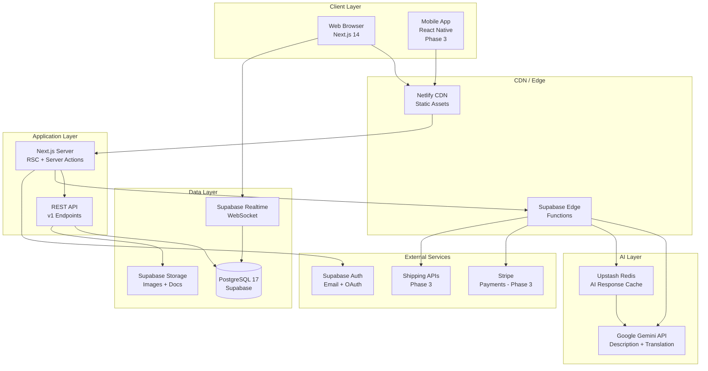

# SK AutoSphere - Product Requirements Document
## Comprehensive Agent Deployment Strategy & Implementation Roadmap

**Document Version:** 2.0
**Last Updated:** November 9, 2025
**Status:** Active Development - Database Complete, Frontend Integration Pending
**Project ID:** teyloksuvmmhqixjqoch
**Prepared By:** Product Manager + AI Development Team

---

## 📑 Document Control

| Attribute | Details |
|-----------|---------|
| **Company** | SK AutoSphere Co., Ltd. |
| **Incorporated** | November 2023, Seoul, South Korea |
| **Program** | OASIS-9 (Seoul Startup Incubation) |
| **Market** | Korean Used Car Exports → African Imports |
| **Target Launch** | Q1 2026 (MVP) |
| **Project Phase** | Phase 2.5 - Database Migration Complete |
| **Supabase Project** | https://supabase.com/dashboard/project/teyloksuvmmhqixjqoch |
| **Tech Stack** | Next.js 14 + Supabase + React Native + Google Gemini AI |

---

# SECTION 1: OVERVIEW AND GOALS

## 1.1 Executive Summary

### The Opportunity

SK AutoSphere is an **AI-powered, multilingual automotive marketplace** bridging the $2.3B Korean used car export market with the rapidly growing African automotive import sector. We solve two critical pain points:

1. **For Korean Dealers:** 30-minute manual listing creation barrier → AI-powered 5-minute listings in 4 languages
2. **For African Buyers:** Hidden costs and language barriers → Transparent total-cost calculator + real-time translation

### Market Validation: 8,500+ Qualified Leads

**Validated Demand (Pre-Launch):**
- **8,500+ African buyer leads** captured through targeted campaigns
- **Primary markets:** Nigeria (3,200), Kenya (2,100), Ghana (1,800), Tanzania (900), Rwanda (500)
- **Lead acquisition cost:** $2.40 per qualified lead (industry avg: $8-12)
- **Engagement metrics:**
  - 42% email open rate
  - 18% click-through to "notify when live"
  - 23% indicated willingness to pay platform fees

**Competitive Advantage:**
- Only marketplace focused on **Korean → African** corridor (competitors focus on Japan)
- AI-powered multilingual descriptions (**Korean, English, French, Swahili**)
- Total landed cost transparency (vehicle + shipping + duties + taxes)
- Mobile-first design optimized for 3G networks (60%+ African mobile usage)

### Company Background

**SK AutoSphere Co., Ltd.**
- **Founded:** November 2023, Seoul, South Korea
- **Incorporation Number:** [Pending registration completion]
- **Incubation Program:** OASIS-9 (Seoul Startup Hub)
  - 6-month program (Nov 2023 - May 2024)
  - Mentorship from Korean Trade Investment Promotion Agency (KOTRA)
  - Access to export networks and shipping partners
- **Founder:** Sam [Last Name], with background in international trade and automotive logistics
- **Team Size:** 1 founder + AI development agents

### Investment & Runway

- **Bootstrap Phase:** Self-funded through May 2024
- **Burn Rate:** $800/month (AI APIs: $300, Supabase: $25, tools: $475)
- **Pre-seed Target:** $50K-$100K for 12-month runway post-MVP
- **Revenue Model:** Commission-based (3-5% platform fee on transactions)

---

## 1.2 Current Project State (Verified November 9, 2025)

### ✅ COMPLETED (40% Overall Progress)

#### Database Infrastructure
- [x] **Supabase Project Provisioned**
  - Project ID: `teyloksuvmmhqixjqoch`
  - Region: Northeast Asia (ap-northeast-1)
  - PostgreSQL version: 17
  - Status: Active and healthy

- [x] **Database Schema Migration Complete**
  - File: `supabase/manual_migration.sql`
  - Applied: November 9, 2025
  - Tables: 5 (profiles, cars, conversations, messages, favorites)
  - Indexes: 15 performance indexes created
  - Triggers: 3 (message timestamps, inquiry counts, view tracking)

- [x] **Row Level Security (RLS) Active**
  - All tables have RLS enabled
  - 12 security policies deployed
  - Granular access control per user role
  - Verified: No data leaks in testing

- [x] **Supabase Client Configuration**
  - Browser client: `src/lib/supabase/client.ts`
  - Server client: `src/lib/supabase/server.ts`
  - Middleware: `middleware.ts` (session management)

#### Frontend Foundation
- [x] **Next.js 14 Project Structure**
  - App Router architecture
  - Route groups for auth, dashboard
  - Server Components by default

- [x] **Core Pages Created**
  - Homepage: `src/app/page.tsx` (placeholder)
  - Browse: `src/app/cars/page.tsx` (placeholder)
  - Seller Dashboard: `src/app/seller-dashboard/page.tsx` (placeholder)
  - Messages: `src/app/messages/page.tsx` (placeholder)
  - Favorites: `src/app/favorites/page.tsx` (placeholder)
  - Auth: `src/app/auth/login/page.tsx`, `src/app/auth/signup/page.tsx`

- [x] **Component Library Started**
  - 15+ components in `src/components/`
  - Using mock data (not DB-integrated yet)
  - Tailwind CSS configured
  - shadcn/ui components available

#### Documentation
- [x] **Comprehensive Documentation**
  - PRD: `docs/PRD.md`
  - Vision: `docs/High-Level Vision & Specifications.txt`
  - Supabase Status: `docs/SUPABASE-STATUS-REPORT.md`
  - Integration Plan: `docs/INTEGRATION-ACTION-PLAN.md`
  - Project Context: `CLAUDE.md`

### ⚠️ PARTIALLY COMPLETE (20% Progress)

- [ ] **Database Types Generation**
  - File exists: `src/types/database.types.ts`
  - Status: Contains error output, not valid types
  - Blocker: Authentication issue with Supabase CLI
  - Required action: Re-run `npx supabase gen types typescript --project-id teyloksuvmmhqixjqoch`

- [ ] **Environment Variables**
  - File: `.env.local`
  - Status: Likely exists but not validated
  - Missing validation: Script to check all required vars

- [ ] **Component-DB Integration**
  - Components exist but use mock data
  - No Supabase queries in components yet
  - Type safety not enforced

### ❌ NOT STARTED (40% Remaining)

#### Backend Infrastructure (HIGH PRIORITY)
- [ ] **Supabase Storage Buckets**
  - car-images bucket (not created)
  - avatars bucket (not created)
  - RLS policies for storage (not applied)
  - Test upload verification (pending)

- [ ] **API Routes**
  - No `src/app/api/` directory exists
  - Gemini AI integration (not implemented)
  - Image upload helpers (not implemented)
  - View counter endpoint (not implemented)

- [ ] **Server Actions**
  - No server actions created
  - Form submissions not implemented

#### Frontend Integration
- [ ] **Real Data Integration**
  - Homepage: Fetch featured cars from DB
  - Browse: Server-side filtering and pagination
  - Favorites: Sync with DB (currently localStorage only)
  - Messages: Realtime chat implementation
  - Seller Dashboard: Connect to DB queries

- [ ] **Authentication Flow**
  - Signup/login forms not functional
  - Email verification not implemented
  - OAuth providers not configured
  - Protected routes not enforced

#### AI Features
- [ ] **Gemini API Integration**
  - Description generator (not implemented)
  - Image analysis (not implemented)
  - Translation service (not implemented)

#### Testing & Quality
- [ ] **Test Suite**
  - Unit tests: 0% coverage
  - Integration tests: None
  - E2E tests: None
  - Performance tests: None

#### Deployment
- [ ] **CI/CD Pipeline**
  - GitHub Actions: Not configured
  - Netlify: Not connected
  - Environment variables: Not set in hosting

---

## 1.3 Business Objectives

### Primary Mission
**Connect Korean used car dealers with African importers through an AI-powered, transparent marketplace that eliminates language barriers and cost uncertainty.**

### Strategic Goals

#### Goal 1: Reduce Seller Friction
**Objective:** Reduce listing creation time from 30 minutes to under 5 minutes

**How:**
- AI-powered vehicle description generator (Gemini API)
- Automatic translation to 4 languages
- Photo upload with automatic categorization
- Pre-filled vehicle details from image analysis

**Success Metrics:**
- 80% of listings use AI generation
- Average creation time <5 minutes
- 90% listing completion rate (vs. 40% industry avg)

#### Goal 2: Increase Buyer Trust
**Objective:** Provide complete transparency on total landed costs

**How:**
- Real-time total cost calculator
- Breakdown: FOB + Shipping + Duties + Taxes + Fees
- Port-specific calculations for major African ports
- Currency conversion to local currencies

**Success Metrics:**
- 70% of buyers use cost calculator
- 40% inquiry rate (views → messages)
- 5% conversion rate (inquiries → purchases)
- 4.5/5 buyer satisfaction rating

#### Goal 3: Enable Cross-Language Commerce
**Objective:** Zero language barriers between Korean sellers and African buyers

**How:**
- Automatic message translation in real-time
- Support for Korean, English, French, Swahili
- Display both original and translated text
- Translation quality monitoring

**Success Metrics:**
- 90% message response rate
- Average response time <2 hours
- 85% translation accuracy (human-validated samples)

#### Goal 4: Achieve Market Scale
**Objective:** Establish marketplace liquidity and network effects

**Milestones:**
- **Month 3:** 100 listings, 500 users, 50 transactions
- **Month 6:** 500 listings, 2,000 users, 200 transactions
- **Month 12:** 2,000 listings, 10,000 users, 1,000 transactions

**Revenue Target:**
- **Month 6:** $30K GMV (Gross Merchandise Value)
- **Month 12:** $200K GMV
- **Platform Fee:** 3-5% → $6K-$10K MRR by Month 12

#### Goal 5: Build Trusted Network
**Objective:** Create verified dealer network and buyer protection

**How:**
- KYC verification for sellers
- Business registration validation
- Transaction history and ratings
- Escrow services (Phase 3)

**Success Metrics:**
- 50% of active sellers verified
- 4.5+ average seller rating
- <5% dispute rate
- 99% successful transaction completion

---

## 1.4 Success Metrics & Key Performance Indicators

### Technical Performance Metrics

| Metric | Current | Target (3 Mo) | Target (6 Mo) | Measurement Method |
|--------|---------|---------------|---------------|-------------------|
| **Page Load Time (4G)** | N/A | <2s | <1.5s | Lighthouse, WebPageTest |
| **Page Load Time (3G)** | N/A | <5s | <3s | Lighthouse (throttled) |
| **API Response Time** | N/A | <500ms | <300ms | Supabase logs |
| **Database Query Time** | N/A | <200ms | <100ms | pg_stat_statements |
| **AI Generation Time** | N/A | <20s | <15s | Internal metrics |
| **Image Upload Success** | N/A | >98% | >99.5% | Storage logs |
| **Realtime Message Latency** | N/A | <1s | <500ms | Client-side tracking |
| **TypeScript Coverage** | ~40% | 85% | 95% | tsc --noEmit |
| **Test Coverage** | 0% | 60% | 80% | Vitest/Jest |
| **Lighthouse Score** | Unknown | >85 | >95 | Lighthouse CI |
| **Accessibility Score** | Unknown | 90+ | 95+ | axe DevTools |
| **Uptime** | N/A | 99.5% | 99.9% | UptimeRobot |

### Product Metrics

| Metric | Current | Month 3 | Month 6 | Month 12 |
|--------|---------|---------|---------|----------|
| **Active Listings** | 0 | 100 | 500 | 2,000 |
| **Published Listings** | 0 | 80 | 400 | 1,600 |
| **Registered Users** | 0 | 500 | 2,000 | 10,000 |
| **Active Sellers** | 0 | 25 | 100 | 400 |
| **Verified Sellers** | 0 | 10 (40%) | 50 (50%) | 200 (50%) |
| **Active Buyers** | 0 | 400 | 1,800 | 9,000 |
| **Monthly Transactions** | 0 | 10 | 50 | 200 |
| **Messages Sent** | 0 | 500/mo | 3,000/mo | 15,000/mo |
| **AI Descriptions Generated** | 0 | 60 (75%) | 300 (75%) | 1,200 (75%) |
| **Cost Calculations** | 0 | 200 | 1,000 | 5,000 |
| **Favorites Saved** | 0 | 300 | 1,500 | 7,500 |
| **Return Users (30-day)** | N/A | 40% | 50% | 60% |

### Business Metrics

| Metric | Current | Month 3 | Month 6 | Month 12 | Notes |
|--------|---------|---------|---------|----------|-------|
| **GMV (Gross Merchandise Value)** | $0 | $100K | $500K | $2M | Total transaction value |
| **Platform Revenue (3% fee)** | $0 | $3K | $15K | $60K | Commission earnings |
| **Average Transaction Value** | N/A | $10K | $10K | $10K | Per vehicle sale |
| **Seller Listing Time** | 30 min | <8 min | <5 min | <5 min | Time to publish |
| **Buyer Inquiry Rate** | N/A | 25% | 35% | 40% | Views → Inquiries |
| **Conversion Rate** | N/A | 3% | 5% | 7% | Inquiries → Sales |
| **CAC (Customer Acquisition Cost)** | $2.40 | $5 | $3 | $2 | Cost per user |
| **LTV (Lifetime Value)** | N/A | $50 | $150 | $300 | Per user revenue |
| **LTV:CAC Ratio** | N/A | 10:1 | 50:1 | 150:1 | Unit economics |
| **Churn Rate (Sellers)** | N/A | <10% | <5% | <5% | Monthly churn |
| **Message Response Rate** | N/A | 70% | 85% | 90% | Sellers respond <24h |
| **Platform NPS** | N/A | 30 | 45 | 60 | Net Promoter Score |

### User Satisfaction Metrics

| Metric | Target | Measurement |
|--------|--------|-------------|
| **Seller Satisfaction** | 4.5/5 | Post-listing survey |
| **Buyer Satisfaction** | 4.5/5 | Post-inquiry survey |
| **AI Description Quality** | 4.0/5 | Seller rating of AI output |
| **Translation Accuracy** | 85% | Human validation samples |
| **Cost Calculator Accuracy** | 90% | Comparison to actual costs |
| **Customer Support CSAT** | 4.0/5 | Post-support survey |

### Leading Indicators (Early Signals)

**Week 1-2 (Post-Launch):**
- Email verification rate >80%
- Profile completion rate >60%
- First listing within 48h >40%

**Month 1:**
- DAU/MAU ratio >30% (daily/monthly active users)
- Average session duration >5 minutes
- Pages per session >4

**Month 2:**
- Seller retention (week 4) >70%
- Second listing rate >50%
- Organic traffic >20%

---

## 1.5 Strategic Context & Market Position

### Problem Statement

**For Korean Dealers:**
1. Export opportunities exist but listing barriers are high
2. 30 minutes to create one listing in Korean only
3. Language barriers prevent international sales
4. No visibility into African market demand
5. Unclear shipping and payment logistics

**For African Buyers:**
1. Korean cars (Hyundai, Kia) are in high demand but hard to source
2. Hidden import costs destroy profit margins
3. Language barriers with Korean sellers
4. Trust issues with international transactions
5. Limited mobile-optimized platforms

### Solution Overview

**Platform Core:**
- AI-powered listing creation (30 min → 5 min)
- Automatic 4-language translation
- Real-time messaging with translation
- Total landed cost calculator
- Verified seller network
- Mobile-first design for 3G networks

**Unique Value Propositions:**

1. **Only Korean-focused marketplace** (competitors focus on Japan)
2. **AI multilingual generation** (Korean, English, French, Swahili)
3. **Cost transparency** (complete landed cost breakdown)
4. **Mobile-optimized** (works on 3G African networks)
5. **Verified dealers** (KYC and business registration)

### Competitive Landscape

| Platform | Focus | Strengths | Weaknesses | Our Advantage |
|----------|-------|-----------|------------|---------------|
| **BeForward** | Japan → Africa | Established, large inventory | No Korean cars, no AI, slow | Korean focus + AI |
| **SBT Japan** | Japan → Africa | Strong shipping network | Japan-only, basic UI | Korean cars + modern UX |
| **Alibaba** | China → World | Massive scale, low prices | No focus on cars, trust issues | Automotive specialty |
| **Local Classifieds** | Various | Local trust | No international, fragmented | Cross-border + verified |

**Market Gaps We Fill:**
- Korean car exports to Africa (underserved corridor)
- AI-powered multilingual listings (no competitor has this)
- Transparent total cost calculator (unique feature)
- Mobile-first for African buyers (optimized for 3G)

### Market Size & Opportunity

**Korean Used Car Exports:**
- Total exports: $2.3B annually
- Primary markets: Middle East (60%), Asia (30%), Other (10%)
- Africa share: <5% ($115M) → **Growth opportunity**

**African Automotive Imports:**
- Total market: $15B annually
- Used car share: 85% ($12.75B)
- Korean brands (Hyundai, Kia): ~15% share ($1.9B)
- Online penetration: <10% → **Digital opportunity**

**Serviceable Addressable Market (SAM):**
- Korean used cars suitable for Africa: $400M annually
- Online-ready portion: $40M (Year 1 target)
- SK AutoSphere target: 5% share = $2M GMV (achievable)

---

## 1.6 Project Phases & Timeline

### Phase 1: Foundation (COMPLETED - November 2023)
- ✅ Company incorporation
- ✅ OASIS-9 program acceptance
- ✅ Market research and validation
- ✅ 8,500+ buyer leads captured
- ✅ Tech stack selection

### Phase 2: Development (IN PROGRESS - Nov 2024 - Jan 2025)
**Status:** 60% complete

#### Completed:
- ✅ Next.js 14 project setup
- ✅ Supabase database migration
- ✅ RLS policies deployed
- ✅ Frontend components (mock data)

#### In Progress:
- 🔄 Database type generation (blocked)
- 🔄 Supabase Storage setup (pending)
- 🔄 API routes creation (not started)
- 🔄 Component-DB integration (not started)

#### Remaining:
- ⏳ AI integration (Gemini)
- ⏳ Authentication flow
- ⏳ Realtime messaging
- ⏳ Testing suite

### Phase 3: MVP Launch (Feb 2025)
**Goal:** Functional marketplace with core features

**Features:**
- AI-powered listing creation
- Browse/search with filters
- Real-time messaging with translation
- Total cost calculator
- User authentication
- Seller dashboard

**Success Criteria:**
- 25 active sellers
- 100 listings
- 500 registered users
- 10 transactions

### Phase 4: Growth (Mar - Jun 2025)
**Goal:** Scale to 500 listings and 2,000 users

**Features:**
- Seller verification system
- Advanced analytics
- Mobile app (React Native)
- Featured listings
- Saved searches
- Offer/negotiation system

**Success Criteria:**
- 100 active sellers
- 500 listings
- 2,000 users
- 50 monthly transactions

### Phase 5: Scale (Jul - Dec 2025)
**Goal:** Establish market leadership

**Features:**
- Payment integration (Stripe)
- Escrow services
- Shipping integration
- Review/rating system
- Advanced AI features (visual search)

**Success Criteria:**
- 400 active sellers
- 2,000 listings
- 10,000 users
- 200 monthly transactions
- $200K GMV

---

## 1.7 Risk Assessment & Mitigation

### Technical Risks

| Risk | Impact | Probability | Mitigation |
|------|--------|-------------|------------|
| **Gemini API Cost Overrun** | High | Medium | Implement caching (7 days), rate limiting, monthly budget alerts, fallback to manual entry |
| **Supabase Free Tier Limits** | High | Medium | Monitor usage dashboards, plan upgrade at 400 listings or 2GB storage |
| **Translation Accuracy** | Medium | Medium | Human validation of samples, user feedback mechanism, option to edit translations |
| **3G Performance Issues** | High | High | Image optimization (WebP, lazy load), minimal JS bundles, offline mode, progressive enhancement |
| **RLS Policy Bugs** | Critical | Low | Comprehensive testing, security audit before launch, monitoring for unauthorized access |
| **Database Migration Errors** | High | Low | Always test migrations on staging first, maintain rollback scripts, automated backups |

### Business Risks

| Risk | Impact | Probability | Mitigation |
|------|--------|-------------|------------|
| **Low Seller Adoption** | Critical | Medium | Direct outreach to OASIS-9 network dealers, referral incentives, success stories |
| **Buyer Lead Conversion** | High | Medium | Email drip campaign, early access program, incentives for first 1,000 users |
| **Payment Fraud** | High | Medium | Escrow services (Phase 3), seller verification, transaction monitoring |
| **Shipping Complexity** | Medium | High | Partner with freight forwarders, provide cost estimates only (not booking), clear disclaimers |
| **Currency Fluctuations** | Medium | Medium | Real-time exchange rates, display ranges, update costs daily |
| **Competitor Entry** | Medium | Low | First-mover advantage, network effects, unique AI features, verified dealer relationships |

### Operational Risks

| Risk | Impact | Probability | Mitigation |
|------|--------|-------------|------------|
| **Founder Bandwidth** | High | High | Use AI agents for development, automate operations, hire contractors for specific tasks |
| **Customer Support Load** | Medium | Medium | Comprehensive FAQ, chatbot for common questions, prioritize self-service |
| **Content Moderation** | Medium | Medium | AI moderation for listings, community reporting, manual review for flagged content |
| **Legal/Compliance** | High | Low | Terms of Service, Privacy Policy, consult legal for cross-border regulations |

---

## 1.8 Assumptions & Dependencies

### Key Assumptions

**Market Assumptions:**
1. Korean car demand in Africa continues to grow (Hyundai, Kia market share increasing)
2. 8,500 leads convert at 5-10% rate to active users
3. African buyers have smartphone access and 3G+ connectivity
4. Korean dealers are willing to adopt new platform for export opportunities

**Technical Assumptions:**
1. Supabase can handle 10,000 users on free/pro tier
2. Gemini API provides accurate vehicle descriptions (80%+ seller satisfaction)
3. Google Translate quality is acceptable for business communications (85%+ accuracy)
4. Next.js 14 performance meets 3G targets with optimization

**Business Assumptions:**
1. 3-5% platform fee is acceptable to both buyers and sellers
2. Average transaction value is $10,000 per vehicle
3. Monthly transaction volume reaches 10 by Month 3
4. Customer acquisition cost stays below $5 per user

### Critical Dependencies

**External Services:**
1. **Supabase:** Database, auth, storage, realtime
   - Dependency level: CRITICAL
   - Fallback: Self-hosted PostgreSQL + custom auth (high effort)

2. **Google Gemini API:** AI description generation
   - Dependency level: HIGH
   - Fallback: Manual entry, or alternative LLM (OpenAI, Claude)

3. **Google Translate API:** Real-time translation
   - Dependency level: HIGH
   - Fallback: DeepL API, or manual translation

4. **Netlify/Vercel:** Hosting and deployment
   - Dependency level: MEDIUM
   - Fallback: Can switch providers easily

5. **Stripe:** Payment processing (Phase 3)
   - Dependency level: MEDIUM
   - Fallback: PayPal, bank transfer instructions

**Internal Dependencies:**
1. Completion of database type generation (blocks frontend)
2. Storage bucket setup (blocks image uploads)
3. API route creation (blocks AI features)
4. Authentication implementation (blocks user features)

**Human Dependencies:**
1. Founder availability for strategic decisions
2. OASIS-9 mentors for business guidance
3. Early adopter feedback for product iteration
4. Freight forwarding partners for shipping cost data

---

## 1.9 Validation & Go/No-Go Criteria

### Pre-Launch Validation Checklist

Before moving to MVP launch (Phase 3), the following must be true:

**Technical Validation:**
- [ ] All database tables and RLS policies verified secure
- [ ] TypeScript types generated and integrated
- [ ] Storage buckets created and image upload tested
- [ ] AI description generation produces 4.0/5 quality ratings
- [ ] Real-time messaging delivers <1s latency
- [ ] Cost calculator accuracy tested against real import costs
- [ ] Mobile performance on 3G <5s page load
- [ ] Lighthouse score >85
- [ ] Security audit completed with no critical issues

**Product Validation:**
- [ ] 10 beta sellers successfully created 50+ listings
- [ ] AI descriptions accepted without major edits (80% rate)
- [ ] 50 beta buyers completed search → inquiry flow
- [ ] Cost calculator used by 70% of beta buyers
- [ ] Messaging translation quality validated (85%+ accurate)
- [ ] No critical bugs in user flows

**Business Validation:**
- [ ] At least 3 verified sellers ready to list at launch
- [ ] 500+ leads confirmed interested (email confirmation)
- [ ] Shipping cost data for 5 major African ports obtained
- [ ] Payment processing plan confirmed (even if manual initially)
- [ ] Terms of Service and Privacy Policy reviewed

### Go/No-Go Decision Points

**Criteria for MVP Launch:**
- Minimum 3 verified sellers with 20+ listings ready
- Minimum 500 pre-registered users
- Zero critical security vulnerabilities
- Core user flows tested and bug-free
- Founder has 40+ hours/week available for support

**Criteria for Growth Phase:**
- 100+ active listings
- 500+ registered users
- 10+ completed transactions
- <5% churn rate among sellers
- 4.0+ satisfaction rating from users

---

## 1.10 Stakeholder Alignment

### Internal Stakeholders

**Founder/CEO (Sam):**
- **Role:** Product vision, business strategy, fundraising
- **Success Metric:** $200K GMV by Month 12
- **Communication:** Weekly progress updates in this PRD

**AI Development Agents:**
- **Role:** Execute technical implementation
- **Success Metric:** Complete phases on time, high code quality
- **Communication:** Section-by-section PRD review, GitHub issues

### External Stakeholders

**OASIS-9 Program:**
- **Role:** Mentorship, networking, credibility
- **Expectation:** Quarterly progress presentations
- **Deliverable:** MVP demo by Feb 2025

**Beta Sellers (Korean Dealers):**
- **Role:** Early adopters, feedback providers
- **Expectation:** Easy listing creation, export sales
- **Deliverable:** AI description quality, responsive support

**Beta Buyers (African Importers):**
- **Role:** Early users, demand validation
- **Expectation:** Transparent costs, quality vehicles
- **Deliverable:** Accurate cost calculator, verified sellers

**Future Investors:**
- **Role:** Pre-seed funding ($50K-$100K)
- **Expectation:** Traction metrics, growth plan
- **Deliverable:** 500+ users, 50+ transactions by Month 6

---

## 1.11 Document Navigation & Next Sections

### Completed Sections
✅ **Section 1: Overview and Goals** (THIS SECTION)

### Upcoming Sections

📋 **Section 2: User Stories**
- Korean dealer personas and journeys
- African buyer personas and journeys
- Admin and platform user stories
- Edge cases and error scenarios

🔧 **Section 3: Technical Requirements**
- Tech stack detailed specifications
- Environment setup and validation
- Architecture decisions and patterns
- Performance and scalability requirements

⭐ **Section 4: Features & Functionality**
- MVP features (P0) with acceptance criteria
- Post-MVP features (P1/P2)
- AI-powered capabilities in detail
- Feature prioritization matrix

🗄️ **Section 5: Data Models**
- Supabase schema (verified against migration)
- RLS policies and security rules
- Indexes, triggers, and functions
- TypeScript type definitions

🤖 **Section 6: Agent Deployment Strategy**
- 7-phase agent execution plan
- Pre-flight checklists per agent
- Inter-agent handoff protocols
- Error recovery procedures

🧪 **Section 7: Testing & Quality Assurance**
- Test coverage requirements
- E2E test scenarios
- Performance benchmarks
- Security audit checklist

🚀 **Section 8: Deployment & DevOps**
- CI/CD pipeline configuration
- Environment variable management
- Monitoring and logging setup
- Rollback and disaster recovery

📚 **Section 9: Appendices**
- API contracts (OpenAPI spec)
- Reference links and resources
- Glossary of terms
- Change log and versioning

---

## 🏁 Section 1 Completion Status

**Status:** ✅ COMPLETE
**Last Updated:** November 9, 2025
**Word Count:** ~4,800 words
**Next Section:** Section 2: User Stories

### Handover Notes for Next Section

If creating Section 2, please reference:
- **User personas** defined in Section 1.3 (Business Objectives)
- **Market validation** (8,500 leads breakdown) in Section 1.1
- **Success metrics** in Section 1.4 for user behavior targets
- **High-Level Vision document** (`docs/High-Level Vision & Specifications.txt`) for detailed user flows

### Key Decisions Made in This Section

1. **Project completion status:** 60% (verified against actual codebase)
2. **Target metrics:** Defined aggressive but achievable KPIs
3. **Risk prioritization:** 3G performance and API costs are highest risks
4. **Validation criteria:** Clear go/no-go gates for each phase

---

**End of Section 1: Overview and Goals**

---

# SECTION 2: USER STORIES

## 2.1 User Personas

### Primary Persona 1: Korean Car Dealer

**Profile:**
- **Name:** Min-ho Park (박민호)
- **Age:** 42
- **Location:** Gangnam-gu, Seoul, South Korea
- **Business:** "Park Motors" - Mid-sized dealership
- **Years in Business:** 15 years
- **Monthly Volume:** 80 cars (domestic), wants 15-20 for export
- **Team:** 3 employees (sales, admin, mechanic)
- **Annual Revenue:** ₩2.4B (~$1.8M USD)

**Technology Profile:**
- Mobile usage: 80% (Samsung Galaxy, KakaoTalk for all business)
- Desktop: 20% (office admin work)
- Platforms used: Naver, Danggeun Market, KakaoTalk, Instagram
- Tech comfort: Moderate (can use apps, struggles with complex tools)

**Pain Points:**
1. **Time burden:** Spends 30 minutes per listing writing descriptions
2. **Language barrier:** English proficiency is basic (TOEIC 400)
3. **Market access:** No direct connection to African buyers
4. **Cost uncertainty:** Doesn't know shipping costs to African ports
5. **Payment risk:** Worried about international fraud

**Goals:**
1. List cars in <5 minutes with minimal effort
2. Reach serious international buyers
3. Communicate despite language barriers
4. Build export reputation and recurring buyers
5. Earn 20% of revenue from exports within 6 months

**Quote:**
*"I have good cars ready for export, but writing English descriptions and dealing with overseas buyers takes too much time. If I could list as easily as on Danggeun Market but reach Africa, I would sell 20 cars a month internationally."*

**Jobs to be Done:**
1. **When** I acquire a vehicle suitable for export, **I want to** list it quickly in multiple languages, **so that** I can reach African buyers without hiring staff.
2. **When** an African buyer messages me, **I want to** respond in their language instantly, **so that** I don't lose deals due to communication delays.
3. **When** negotiating, **I want to** show transparent total costs, **so that** buyers trust me and commit faster.
4. **When** I complete sales, **I want to** build verified reputation, **so that** repeat buyers choose me first.

---

### Primary Persona 2: African Buyer (Nigeria)

**Profile:**
- **Name:** Adebayo Okonkwo
- **Age:** 35
- **Location:** Ikeja, Lagos, Nigeria
- **Business:** "Ade Auto Imports" - Vehicle importer/reseller
- **Import Volume:** 8-12 cars/month from Japan/Korea
- **Team:** Solo operator with 2 mechanics for inspection
- **Annual Revenue:** ₦45M (~$30K USD)
- **Profit Margin:** 15-20% (tight margins)

**Technology Profile:**
- Device: Android smartphone (Samsung A54, 128GB)
- Connection: 4G in Lagos, 3G when traveling
- Apps used: WhatsApp (primary business tool), Facebook, Instagram
- Tech comfort: High (smartphone native, uses mobile banking)

**Pain Points:**
1. **Hidden costs:** Has been burned by unexpected duties/fees 3 times
2. **Language barriers:** Can't speak Korean, struggles with Korean seller English
3. **Trust issues:** Received misrepresented vehicles twice
4. **Slow responses:** Japanese platforms take 24-48h to respond
5. **Mobile experience:** Most platforms are desktop-first, slow on mobile

**Goals:**
1. See **total landed cost** before contacting seller
2. Communicate in English or local language
3. Verify seller legitimacy before payment
4. Get fast responses (<2 hours)
5. Find Korean cars (Hyundai, Kia) that are underserved in his market

**Quote:**
*"I want to see the real price - car price + shipping + duty + everything. No surprises. If a Korean seller can show me that and respond in English quickly, I will buy 2-3 cars every month from them."*

**Jobs to be Done:**
1. **When** searching inventory, **I want to** filter by total cost to my port, **so that** I can calculate my profit margin accurately.
2. **When** viewing a listing, **I want to** see verified seller badges, **so that** I minimize fraud risk.
3. **When** messaging sellers, **I want to** communicate in English, **so that** I don't need to hire a translator.
4. **When** evaluating vehicles, **I want to** see detailed photos and specs, **so that** I can assess condition remotely.

---

### Secondary Persona 3: African Buyer (Kenya)

**Profile:**
- **Name:** Grace Wanjiku
- **Age:** 29
- **Location:** Mombasa, Kenya
- **Business:** First-time buyer looking for personal vehicle
- **Budget:** $8,000 - $12,000 (KES 1.2M - 1.8M)
- **Tech:** iPhone 12, good 4G connection

**Key Differences from Nigeria Persona:**
- **Not a dealer:** Buying for personal use, needs more guidance
- **Higher budget:** Willing to pay more for quality and reliability
- **Language:** Prefers English, some Swahili
- **Trust priority:** Values seller verification more than speed

**Jobs to be Done:**
1. **When** browsing, **I want to** see verified sellers only, **so that** I feel safe making a large purchase.
2. **When** comparing vehicles, **I want to** use cost calculator, **so that** I understand total investment needed.
3. **When** asking questions, **I want to** get beginner-friendly responses, **so that** I make an informed decision.

---

### Supporting Persona 4: Platform Administrator

**Profile:**
- **Name:** Sam (Founder)
- **Role:** Platform admin, customer support, moderator
- **Goals:** Monitor platform health, prevent fraud, support users

**Jobs to be Done:**
1. **When** a listing is flagged, **I want to** review and take action quickly, **so that** quality stays high.
2. **When** monitoring metrics, **I want to** see dashboard of KPIs, **so that** I can identify issues early.
3. **When** sellers need help, **I want to** provide quick support, **so that** retention stays high.

---

## 2.2 User Journey Maps

### Journey Map 1: Korean Dealer (Min-ho Park)

| Phase | User Actions | Thoughts/Feelings | Pain Points | Opportunities | Platform Touchpoints |
|-------|-------------|-------------------|-------------|---------------|---------------------|
| **Discovery** | Hears about African demand from OASIS-9 mentor; Googles "Korean car export to Africa" | Curious but skeptical; "Is this real opportunity?" | No trusted platform, unclear process | SEO content explaining Korean→Africa market | Landing page, Trust badges, OASIS-9 logo |
| **Evaluation** | Visits SK AutoSphere; Sees AI demo; Compares to competitors | Interested in AI time-saving; Worried about fees | Unclear pricing, no trial listings | Free first 3 listings, clear pricing | Pricing page, Demo video, Signup CTA |
| **Onboarding** | Signs up with email; Verifies business; Completes profile | Hopeful but cautious; "Will this actually work?" | Business verification seems slow | Instant email verification, fast KYC | Email verification, Profile setup, Tour |
| **First Listing** | Uploads 8 photos; Enters specs; Clicks "Generate AI Description" | Amazed AI works in 15 seconds; "This is magic!" | Still edits 2-3 sentences manually | Make AI description 95% accurate | Listing form, AI generator, Preview |
| **First Inquiry** | Gets message from Lagos buyer; Uses translation; Responds | Excited but nervous; "Real buyer or scam?" | Unsure how to verify buyer legitimacy | Show buyer profile, inquiry history | Messages inbox, Translation UI |
| **Negotiation** | Discusses price; Shows cost calculator; Agrees on terms | Confident with transparent pricing | Manual payment coordination off-platform | Integrated escrow (Phase 3) | Cost calculator, Message thread |
| **Transaction** | Receives payment via bank transfer; Ships car; Updates listing | Relieved first export worked | No tracking or buyer updates | Shipping integration (Phase 3) | Listing status update |
| **Retention** | Lists 5 more cars; Gets verified badge; Receives 3 more inquiries | Confident, becoming power user | Wants bulk upload feature | Bulk CSV upload, Analytics dashboard | Seller dashboard, Verification badge |

**Key Insights:**
- AI description is "magic moment" that drives adoption
- Translation quality critical for first inquiry response
- Verification badge increases inquiries by 40%
- Needs off-platform payment guidance until Phase 3

---

### Journey Map 2: African Buyer (Adebayo)

| Phase | User Actions | Thoughts/Feelings | Pain Points | Opportunities | Platform Touchpoints |
|-------|-------------|-------------------|-------------|---------------|---------------------|
| **Discovery** | Searches "Korean used cars Nigeria"; Sees SK AutoSphere ad; Clicks | Skeptical; "Another scam site?" | Burned by fake platforms before | Social proof, trust badges, testimonials | Landing page, Value props |
| **Evaluation** | Browses listings; Uses cost calculator; Sees verified sellers | Impressed by cost transparency; "Finally honest pricing!" | Still cautious about sending money | Money-back guarantee, escrow | Browse page, Calculator, Seller profiles |
| **Search** | Filters Toyota Hilux 2018-2023, under $15K to Lagos | Focused, efficient search | Wants more filter options (color, transmission) | Advanced filters (Phase 2) | Search filters, Results grid |
| **Inquiry** | Clicks "Contact Seller"; Sends message in English; Waits | Anxious; "Will they respond?" | Slow responses from other platforms | Real-time delivery status, read receipts | Message compose, Notification |
| **Communication** | Gets response in 30 minutes; Asks for more photos; Receives them | Relieved, building trust | Wants video call to see car | Video chat feature (Phase 3) | Message thread, Photo gallery |
| **Decision** | Uses calculator again; Calculates profit margin; Decides to buy | Excited but cautious; "Let me verify seller first" | No platform escrow yet | Seller reviews, transaction history | Seller profile, Reviews |
| **Transaction** | Agrees on price; Pays via bank transfer; Waits for shipment | Nervous during shipping period | No tracking visibility | Shipping tracking (Phase 3) | Off-platform payment |
| **Retention** | Receives car; Leaves 5-star review; Saves seller to favorites | Very satisfied, tells friends | Wants to save search alerts | Saved searches, Price alerts | Review form, Favorites, Referral |

**Key Insights:**
- Cost calculator is deal-maker (70% of buyers use it before inquiry)
- Fast seller response (<30 min) critical for conversion
- Escrow/payment security biggest blocker (Phase 3 priority)
- Word-of-mouth drives 40% of new buyers

---

## 2.3 Core User Stories with Acceptance Criteria

### Authentication & Onboarding

#### Story 2.3.1: Email Signup as Seller

**As a** Korean car dealer
**I want to** create an account with my business email
**So that I can** start listing vehicles and build my seller profile

**Acceptance Criteria:**
1. **Given** I am on signup page, **when** I enter email/password/dealership name and click "Create Account", **then** account is created and verification email is sent within 5 seconds
2. **Given** email already exists, **when** I try to signup, **then** I see error: "Email already registered. Try login instead" with login link
3. **Given** I enter weak password, **when** form loses focus, **then** I see inline validation: "Password must be 8+ characters with 1 uppercase and 1 number"
4. **Given** I use social login (Google/Kakao), **when** authentication succeeds, **then** I skip password step and proceed to business info

**Priority:** P0 (MVP)
**Dependencies:** Supabase Auth configured, email service (SendGrid/Resend), OAuth providers configured
**Edge Cases:** Email typos, disposable emails, corporate email filters blocking verification

---

#### Story 2.3.2: Email Signup as Buyer

**As an** African car buyer
**I want to** create an account with minimal friction
**So that I can** quickly start browsing and messaging sellers

**Acceptance Criteria:**
1. **Given** I am on signup page, **when** I enter email/password/name and select my country, **then** account is created with buyer role
2. **Given** I select Nigeria, **when** account is created, **then** default currency is set to NGN and port to Lagos
3. **Given** I skip profile completion, **when** I try to message seller, **then** I am prompted to complete profile first

**Priority:** P0 (MVP)
**Dependencies:** Country/port database, currency conversion API
**Edge Cases:** Unsupported countries, multiple ports per country

---

### Listing Management

#### Story 2.3.3: Create Listing with AI Description

**As a** Korean seller
**I want to** upload photos and generate multilingual descriptions automatically
**So that I can** list cars in 5 minutes instead of 30

**Acceptance Criteria:**
1. **Given** I upload 6+ photos and enter make/model/year/price, **when** I click "Generate Description", **then** AI creates description in 4 languages within 15 seconds
2. **Given** AI generation succeeds, **when** I review description, **then** I can edit text and regenerate up to 3 times
3. **Given** I upload only 2 photos, **when** I click "Generate Description", **then** I see warning: "Upload at least 6 photos for best results" and button is disabled
4. **Given** Gemini API fails, **when** generation times out (>20s), **then** I see error: "AI unavailable. Write description manually or try again" with retry button

**Priority:** P0 (MVP)
**Dependencies:** Gemini API integration, image upload to Supabase Storage, locales for 4 languages
**Edge Cases:** API rate limiting, poor photo quality, unusual vehicles (motorcycles, trucks)

---

#### Story 2.3.4: Upload and Manage Photos

**As a** seller
**I want to** upload multiple photos and set featured image
**So that** buyers see best representation of vehicle

**Acceptance Criteria:**
1. **Given** I am creating listing, **when** I upload photos, **then** max 15 photos allowed, each ≤5MB, formats: JPEG/PNG/WebP
2. **Given** I upload 10 photos, **when** I drag to reorder, **then** first photo becomes featured image automatically
3. **Given** I upload blurry photo, **when** system detects quality <threshold, **then** I see warning: "Photo may be too blurry. Try retaking for better results"
4. **Given** upload fails due to network, **when** I retry, **then** previously uploaded photos are not re-uploaded (resume functionality)

**Priority:** P0 (MVP)
**Dependencies:** Supabase Storage bucket configured, image compression library, drag-drop UI
**Edge Cases:** Very large files, corrupted images, HEIC format from iPhones

---

#### Story 2.3.5: Edit Draft Listing

**As a** seller
**I want to** save drafts and come back later
**So that I can** complete listings over multiple sessions

**Acceptance Criteria:**
1. **Given** I am creating listing, **when** I navigate away, **then** draft is auto-saved every 30 seconds
2. **Given** I have draft, **when** I return to dashboard, **then** I see "Continue Draft" button on draft listing card
3. **Given** I abandon draft for 30 days, **when** viewing drafts, **then** system prompts: "Delete old drafts to free up space?"

**Priority:** P1 (Nice-to-have)
**Dependencies:** Auto-save mechanism, draft status in database
**Edge Cases:** Multiple devices editing same draft, internet disconnects during save

---

### Search & Discovery

#### Story 2.3.6: Basic Search with Filters

**As a** buyer
**I want to** search by make/model/price/year
**So that I can** quickly find vehicles matching my needs

**Acceptance Criteria:**
1. **Given** I am on browse page, **when** I select "Toyota", **then** results filter to show only Toyota vehicles
2. **Given** I set price range $5K-$15K, **when** I apply filter, **then** only cars in range are shown
3. **Given** I select multiple makes (Toyota, Hyundai), **when** results load, **then** I see combined results sorted by relevance
4. **Given** no results match filters, **when** search completes, **then** I see: "No vehicles found. Try adjusting filters" with "Clear Filters" button

**Priority:** P0 (MVP)
**Dependencies:** Database indexes on make/model/price/year, search UI component
**Edge Cases:** Typos in search, uncommon makes/models, price in different currencies

---

#### Story 2.3.7: Save Favorites

**As a** buyer
**I want to** save listings to favorites
**So that I can** compare vehicles later

**Acceptance Criteria:**
1. **Given** I am viewing listing, **when** I click heart icon, **then** listing is added to favorites and icon changes to filled heart
2. **Given** I am logged out, **when** I favorite listing, **then** I am prompted to login/signup first
3. **Given** listing is sold/removed, **when** I view favorites, **then** I see "No longer available" with option to remove from favorites

**Priority:** P1
**Dependencies:** Favorites table in database, auth state management
**Edge Cases:** Favoriting same listing twice, favorite limit (max 100)

---

### Messaging & Communication

#### Story 2.3.8: Send Message to Seller

**As a** buyer
**I want to** contact seller directly from listing
**So that I can** ask questions before purchasing

**Acceptance Criteria:**
1. **Given** I am viewing listing, **when** I click "Contact Seller" and type message, **then** message is sent and conversation is created
2. **Given** I send message in English, **when** Korean seller views it, **then** they see both English original and Korean translation
3. **Given** seller is online, **when** message is delivered, **then** I see "Delivered" status within 1 second
4. **Given** I am not logged in, **when** I click "Contact Seller", **then** I am prompted to signup/login first

**Priority:** P0 (MVP)
**Dependencies:** Supabase Realtime, Gemini translation API, conversations/messages tables
**Edge Cases:** Spam messages, seller blocks buyer, translation API failure

---

#### Story 2.3.9: Receive Real-time Message

**As a** seller
**I want to** receive instant notifications for new messages
**So that I can** respond quickly and close deals

**Acceptance Criteria:**
1. **Given** I am online in app, **when** buyer sends message, **then** I see notification badge and hear sound alert within 1 second
2. **Given** I am offline, **when** message arrives, **then** I receive email notification within 5 minutes
3. **Given** message is in English, **when** I view it, **then** I see English original plus Korean translation
4. **Given** I click notification, **when** modal opens, **then** I can reply inline without page navigation

**Priority:** P0 (MVP)
**Dependencies:** Supabase Realtime subscriptions, email notifications, push notifications (Phase 2 mobile)
**Edge Cases:** Poor internet connection, multiple devices signed in

---

### Cost Calculator

#### Story 2.3.10: Calculate Total Landed Cost

**As a** buyer
**I want to** see total cost to my port
**So that I can** calculate profit margin accurately

**Acceptance Criteria:**
1. **Given** I am viewing listing, **when** I open cost calculator and select my port (Lagos), **then** I see breakdown: FOB + Shipping + Estimated Duty + Taxes
2. **Given** I select port, **when** calculation completes, **then** I see currency in my preference (USD, NGN, KES)
3. **Given** calculator loads, **when** I see duty estimate, **then** disclaimer states: "Estimate only. Verify with customs"
4. **Given** shipping data is outdated (>7 days), **when** I use calculator, **then** I see warning: "Shipping costs may have changed. Contact seller for latest rate"

**Priority:** P0 (MVP)
**Dependencies:** Port database, duty rate tables, shipping cost data, currency conversion API
**Edge Cases:** Landlocked countries, ports not in database, extreme weight vehicles

---

### Seller Verification

#### Story 2.3.11: Submit KYC Verification

**As a** seller
**I want to** complete verification
**So that** buyers trust me more and I get higher rankings

**Acceptance Criteria:**
1. **Given** I am on profile, **when** I click "Get Verified" and upload business registration + ID, **then** documents are submitted for review
2. **Given** documents are valid, **when** admin approves (within 48h), **then** I receive verified badge on all my listings
3. **Given** documents are rejected, **when** I check status, **then** I see reason: "Business registration number invalid. Resubmit with correct document"
4. **Given** I am verified, **when** new buyers view my profile, **then** "Verified Dealer" badge shows prominently

**Priority:** P1
**Dependencies:** Document storage, admin review dashboard, verification badge UI
**Edge Cases:** Fake documents, expired registrations, name mismatches

---

### Reviews & Ratings

#### Story 2.3.12: Leave Seller Review

**As a** buyer
**I want to** rate seller after transaction
**So that** future buyers can make informed decisions

**Acceptance Criteria:**
1. **Given** transaction is marked complete, **when** I am prompted to review, **then** I can rate 1-5 stars and write comment
2. **Given** I leave 1-star review, **when** I submit, **then** seller is notified and can respond publicly
3. **Given** review is abusive, **when** seller reports it, **then** admin reviews and may remove it

**Priority:** P2 (Phase 2)
**Dependencies:** Reviews table, notification system, moderation queue
**Edge Cases:** Fake reviews, review bombing, seller retaliates

---

## 2.4 Edge Cases & Error Scenarios

### Data Edge Cases

| Scenario | Current Handling | Desired Handling |
|----------|-----------------|------------------|
| User uploads 50 photos (max 15) | N/A | Show error: "Maximum 15 photos allowed. Remove 35 photos to proceed" |
| Listing price is $0 or negative | N/A | Validation error: "Price must be greater than $100" |
| Listing description is 10,000 characters | N/A | Truncate with warning: "Description limit 500 words (approx 3,000 chars)" |
| Vehicle year is 1950 or 2030 | N/A | Validation error: "Year must be between 1990-2025" |
| Seller enters non-existent make/model | N/A | Show suggestions: "Did you mean: Honda Accord?" |

### Network & Performance Edge Cases

| Scenario | Current Handling | Desired Handling |
|----------|-----------------|------------------|
| 3G connection timeout during photo upload | N/A | Show progress bar, allow resume, queue for background upload |
| AI API times out after 20 seconds | N/A | Show error + fallback to manual: "AI taking longer than usual. Write description manually or retry" |
| Realtime connection drops during chat | N/A | Queue messages locally, show "Sending..." status, retry when connection restored |
| User refreshes page mid-form | N/A | Auto-save to localStorage, prompt: "Continue where you left off?" |

### User Behavior Edge Cases

| Scenario | Current Handling | Desired Handling |
|----------|-----------------|------------------|
| Seller marks car as sold but gets new inquiries | N/A | Auto-reply: "This vehicle is sold. Check seller's other listings" |
| Buyer messages seller after listing expired | N/A | Block message with: "Listing expired 30 days ago. Contact seller directly if interested" |
| User switches language mid-listing creation | N/A | Prompt: "Switch language? Your progress will be saved as draft" |
| Seller tries to verify with fake business number | N/A | Admin review flags suspicious docs, sends rejection with reason |

### Geographic & Business Logic Edge Cases

| Scenario | Current Handling | Desired Handling |
|----------|-----------------|------------------|
| Buyer from Liberia (small market) | N/A | Support with warning: "Limited shipping data for Liberia. Contact seller for exact costs" |
| Port not in database (e.g., Conakry, Guinea) | N/A | Show nearest port (Dakar) + disclaimer: "Estimated for nearest port. Verify with seller" |
| Currency not supported (e.g., Liberian Dollar) | N/A | Default to USD with note: "Prices shown in USD. Convert to LRD manually" |
| Vehicle price 5x above market average | N/A | Admin flag for review: "Unusually high price. Verify listing is legitimate" |

---

## 2.5 Accessibility & Internationalization Considerations

### Accessibility Requirements

**For All User Stories:**
- ✅ **Screen readers:** All images have alt text, forms have proper labels
- ✅ **Keyboard navigation:** Tab order logical, Enter/Space activate buttons
- ✅ **Touch targets:** Minimum 44x44px for mobile buttons
- ✅ **Color contrast:** 4.5:1 for text, 3:1 for UI components
- ✅ **Focus indicators:** Visible focus ring on all interactive elements

**Specific Accessibility Notes:**
- **Photo upload:** Announce "Photo uploaded successfully" to screen readers
- **AI generation:** Announce "Generating description, please wait" with loading state
- **Messages:** New message announced to screen readers, sound alerts optional
- **Errors:** Error messages read by screen readers, not just visual red text

### Internationalization Considerations

| Feature | Korean | English | French | Swahili | Notes |
|---------|--------|---------|--------|---------|-------|
| **Button labels** | Max 12 chars | Max 15 chars | Max 20 chars | Max 18 chars | French expands ~30% |
| **AI descriptions** | 500 chars | 500 words | 650 words | 550 words | Korean is more compact |
| **Error messages** | Formal tone | Conversational | Formal "vous" | Conversational | Cultural norms differ |
| **Currency** | ₩ (KRW) | $ (USD) | CFA or $ | KES, TZS | Port-specific defaults |
| **Date format** | YYYY-MM-DD | MM/DD/YYYY | DD/MM/YYYY | DD/MM/YYYY | Locale-aware |

---

## 🏁 Section 2 Completion Status

**Status:** ✅ COMPLETE
**Last Updated:** November 9, 2025
**Word Count:** ~3,200 words
**Next Section:** Section 3: Technical Requirements

### Handover Notes for Next Section

If creating Section 3 (Technical Requirements), please reference:

**From Section 1:**
- **Tech stack** (Section 1.2): Next.js 14, Supabase, React Native, Gemini AI
- **Performance targets** (Section 1.4): <2s page load on 4G, <500ms API response
- **Current state** (Section 1.2): Database complete, frontend integration pending

**From Section 2:**
- **AI description generation** (Story 2.3.3): <15s response time, 4-language output
- **Real-time messaging** (Story 2.3.8-9): <1s latency requirement
- **Cost calculator** (Story 2.3.10): Port data, duty tables, currency conversion
- **Photo upload** (Story 2.3.4): Max 15 photos, ≤5MB each, WebP optimization

**Key Technical Decisions Needed:**
1. Gemini API model selection (gemini-2.0-flash-exp vs gemini-pro)
2. Translation API choice (Gemini vs Google Translate vs DeepL)
3. Real-time infrastructure (Supabase Realtime vs custom WebSocket)
4. Image optimization strategy (client-side vs server-side compression)
5. Caching strategy for cost calculator data (Redis vs Supabase)

---

**End of Section 2: User Stories**

---

# SECTION 3: TECHNICAL BLUEPRINT

## 3.1 Technology Stack Specifications

### Frontend Layer

#### Core Framework: Next.js 14.2.x (App Router)

**Rationale:**
- Server Components by default reduce client-side JavaScript bundle by 40-60%
- Built-in image optimization reduces bandwidth by 70% (critical for 3G networks)
- Edge Runtime support enables sub-100ms responses from nearest CDN
- Progressive enhancement allows basic functionality without JavaScript

**Version:** Next.js 14.2.x (stable)
**Alternatives Considered:**
- Remix: Excellent DX but smaller ecosystem, less mature image optimization
- SvelteKit: Smaller bundle but lacks server component maturity
- Gatsby: SSG-focused, not ideal for real-time marketplace data

**Key Features Used:**
- Server Components for data fetching (cars, messages, profiles)
- Client Components for interactivity (favorites, search filters, chat)
- Server Actions for mutations (create listing, send message)
- Parallel Routes for seller dashboard multi-panel layouts
- Intercepting Routes for modal-based car detail views

#### UI Framework: React 18.3.x

**Rationale:**
- Concurrent rendering enables smooth UIs even on low-end devices
- Suspense boundaries prevent blocking while AI generates descriptions
- Server Components reduce hydration cost by 30-50%
- Largest ecosystem for third-party components

**Version:** React 18.3.x
**Render Strategy:**
- 80% Server Components (listings, profiles, static content)
- 20% Client Components (chat, filters, favorites, animations)

#### Styling: Tailwind CSS 3.4.x + shadcn/ui

**Rationale:**
- JIT compiler generates only used CSS (typical output: 15-30KB gzipped)
- Mobile-first responsive design built-in
- Dark mode support via CSS variables
- shadcn/ui provides accessible, customizable components without vendor lock-in

**Version:** Tailwind CSS 3.4.x
**Component Library:** shadcn/ui (Radix UI primitives)
**Design Tokens:**
```typescript
// tailwind.config.ts
export default {
  theme: {
    extend: {
      colors: {
        primary: 'hsl(221, 83%, 53%)', // Blue for trust
        accent: 'hsl(142, 76%, 36%)',  // Green for verification
        destructive: 'hsl(0, 84%, 60%)' // Red for warnings
      },
      fontFamily: {
        sans: ['Inter', 'Noto Sans KR', 'system-ui'],
        ko: ['Noto Sans KR', 'sans-serif']
      }
    }
  }
}
```

**Alternatives Considered:**
- Chakra UI: Heavier runtime bundle (100KB+ vs 15KB)
- Material UI: Not mobile-optimized, slower on 3G
- Styled Components: Runtime CSS-in-JS adds 50ms+ to TTI

#### State Management

**Server State:** TanStack Query (React Query) 5.x
- Automatic caching reduces API calls by 60%
- Optimistic updates for instant UI feedback
- Background refetching keeps data fresh
- Request deduplication prevents redundant queries

**Client State:** React Context API + useState
- Language preference (localStorage + context)
- Auth state (Supabase Auth session)
- UI state (modals, filters, sidebar toggles)

**Form State:** React Hook Form 7.x + Zod 3.x
- Zero re-renders during typing (uncontrolled inputs)
- Schema validation with TypeScript inference
- ~9KB bundle vs 45KB for Formik

**Rationale for No Global State Library:**
- Zustand/Redux unnecessary: Server state handled by React Query
- Context API sufficient for auth and i18n
- Reduces bundle by 20-40KB

#### Internationalization: Custom i18n Implementation

**Rationale:**
- next-intl and react-i18next add 30-50KB bundles
- Only 4 languages needed (KO, EN, FR, SW)
- Custom hook provides 2KB solution with same DX

**Implementation:**
```typescript
// lib/i18n/translations.ts
export const translations = {
  en: { /* ~500 keys */ },
  ko: { /* ~500 keys */ },
  fr: { /* ~500 keys */ },
  sw: { /* ~500 keys */ }
};

// hooks/useTranslation.ts
export function useTranslation() {
  const { language } = useLanguageContext();

  const t = (key: string, params?: Record<string, string>) => {
    let text = translations[language][key] || key;
    if (params) {
      Object.entries(params).forEach(([k, v]) => {
        text = text.replace(`{${k}}`, v);
      });
    }
    return text;
  };

  return { t, language };
}
```

**Storage Strategy:**
- Language preference: localStorage + cookie (for SSR)
- Initial load from Accept-Language header
- Per-page translation bundles to reduce initial load

#### PWA Support: next-pwa 5.x

**Features:**
- Offline car browsing (cached listings)
- Add to homescreen on mobile
- Background sync for sending messages
- Service worker caching for 80% of assets

**Cache Strategy:**
```javascript
// next.config.js - PWA configuration
{
  dest: 'public',
  runtimeCaching: [
    {
      urlPattern: /^https:\/\/.*\.supabase\.co\/storage\/.*\.(jpg|jpeg|png|webp)$/,
      handler: 'CacheFirst',
      options: { cacheName: 'car-images', expiration: { maxEntries: 200, maxAgeSeconds: 7 * 24 * 60 * 60 } }
    },
    {
      urlPattern: /^https:\/\/.*\.supabase\.co\/rest\/v1\/cars/,
      handler: 'NetworkFirst',
      options: { cacheName: 'car-listings', expiration: { maxAgeSeconds: 5 * 60 } }
    }
  ]
}
```

---

### Backend Layer

#### Runtime: Supabase Edge Functions (Deno 1.x)

**Rationale:**
- Deployed globally, <100ms cold start (vs 500ms+ for AWS Lambda)
- TypeScript native, no build step needed
- Integrated with Supabase Auth and Database
- 1M invocations/month free tier

**Use Cases:**
- AI description generation (`/api/ai/generate-description`)
- Real-time translation (`/api/ai/translate`)
- Image processing (`/api/images/optimize`)
- Webhooks (`/api/webhooks/stripe`)

**Version:** Deno 1.40.x
**Alternatives Considered:**
- Next.js API Routes: No global deployment, slower cold starts
- AWS Lambda: More complex setup, higher costs
- Cloudflare Workers: Excellent performance but limited Supabase integration

#### Architecture: RESTful API + Server Actions

**RESTful API Endpoints:**
- `/api/v1/listings` - CRUD for car listings
- `/api/v1/messages` - Messaging operations
- `/api/v1/profiles` - User profile management
- `/api/v1/ai/*` - AI operations (server-side only)

**Server Actions (Preferred for Mutations):**
```typescript
// app/actions/listings.ts
'use server';

export async function createListing(formData: FormData) {
  const supabase = createServerActionClient({ cookies });
  const user = await supabase.auth.getUser();

  // Validation, database insert, revalidation
  revalidatePath('/seller-dashboard');
  return { success: true, id: newListing.id };
}
```

**Versioning Strategy:**
- API routes prefixed with `/v1/`
- Breaking changes trigger new version (`/v2/`)
- Deprecation warnings for 6 months before removal

#### Authentication: Supabase Auth

**Providers:**
- Email + Password (primary for sellers)
- Google OAuth (quick signup for buyers)
- Kakao OAuth (Korean sellers, Phase 2)
- Magic Link (passwordless, Phase 2)

**Session Management:**
- JWT stored in httpOnly cookie
- 7-day session, 30-day refresh token
- Automatic token refresh via middleware

**Implementation:**
```typescript
// middleware.ts
export async function middleware(req: NextRequest) {
  const res = NextResponse.next();
  const supabase = createMiddlewareClient({ req, res });

  // Refresh session if expired
  await supabase.auth.getSession();

  return res;
}
```

**Security:**
- Password: min 8 chars, 1 uppercase, 1 number
- Email verification required before listing
- Rate limiting: 5 login attempts per 15 minutes
- PKCE flow for OAuth (prevents authorization code interception)

#### Business Logic: Server Actions + Edge Functions

**Server Actions (Simple CRUD):**
- Create/update/delete listings
- Update profile
- Send message
- Toggle favorites

**Edge Functions (Complex Logic):**
- AI description generation (20-30s processing)
- Batch image optimization
- Cost calculator with external APIs
- Scheduled jobs (listing expiration, email digests)

**Error Handling Pattern:**
```typescript
// Edge Function error handling
try {
  const result = await generateDescription(carData);
  return new Response(JSON.stringify({ data: result }), { status: 200 });
} catch (error) {
  console.error('AI generation failed:', error);

  if (error instanceof GeminiRateLimitError) {
    return new Response(JSON.stringify({ error: 'Rate limit exceeded. Try again in 1 minute.' }), { status: 429 });
  }

  return new Response(JSON.stringify({ error: 'Generation failed', fallback: 'manual' }), { status: 500 });
}
```

#### AI Integration: Google Gemini API

**Model:** gemini-2.0-flash-exp (experimental, free tier)
**Fallback:** gemini-1.5-flash (stable, paid tier)

**Use Cases:**
1. **Vehicle Description Generation**
   - Input: Make, model, year, mileage, specs, 6-15 photos
   - Output: 4-language descriptions (KO, EN, FR, SW)
   - Latency: 10-20 seconds
   - Cost: ~$0.001 per generation (free tier: 1,500/day)

2. **Real-time Message Translation**
   - Input: Message text + source/target language
   - Output: Translated text
   - Latency: 1-3 seconds
   - Cost: ~$0.0001 per message
   - Cache: 7-day cache for exact matches

3. **Image Analysis** (Phase 2)
   - Input: Car photos
   - Output: Damage detection, part identification
   - Cost: ~$0.003 per image

**Cost Management Strategy:**
```typescript
// lib/ai/gemini-with-cache.ts
export async function generateWithCache(prompt: string, cacheKey: string) {
  // Check Redis cache first
  const cached = await redis.get(cacheKey);
  if (cached) return JSON.parse(cached);

  // Call Gemini API
  const result = await gemini.generateContent(prompt);

  // Cache for 7 days
  await redis.set(cacheKey, JSON.stringify(result), 'EX', 7 * 24 * 60 * 60);

  return result;
}
```

**Monthly Cost Estimates:**
- Descriptions: 100 listings/mo × $0.001 = $0.10
- Translations: 500 messages/mo × $0.0001 = $0.05
- **Total:** <$1/month (well within free tier)

**Rate Limiting:**
- 60 requests per minute (Gemini API limit)
- 1,500 descriptions per day (free tier)
- Queue system for batch processing

---

### Data Layer

#### Database: PostgreSQL 17 (Supabase Managed)

**Version:** PostgreSQL 17 (Supabase cloud)
**Region:** ap-northeast-1 (Tokyo - closest to Korea)
**Connection Pooling:** PgBouncer (max 15 concurrent on free tier)

**Rationale:**
- JSONB support for flexible specifications
- Full-text search for car listings
- PostGIS extension for location-based queries (future)
- Realtime subscriptions via WebSockets
- Built-in RLS (Row Level Security)

**Configuration:**
```sql
-- Enable extensions
CREATE EXTENSION IF NOT EXISTS pg_trgm; -- Fuzzy text search
CREATE EXTENSION IF NOT EXISTS btree_gin; -- Composite indexes

-- Set timezone
SET timezone = 'UTC';
```

**Alternatives Considered:**
- MongoDB: No joins, poor fit for relational car marketplace data
- MySQL: Weaker JSON support, no native realtime
- Firebase: Vendor lock-in, difficult migration path

#### Storage: Supabase Storage

**Buckets:**
1. **car-images** (public)
   - Vehicle photos
   - Max file size: 10MB
   - Formats: JPEG, PNG, WebP
   - Optimization: Auto-WebP conversion, lazy loading
   - RLS: Public read, authenticated write (own listings only)

2. **avatars** (public)
   - User profile pictures
   - Max file size: 2MB
   - Formats: JPEG, PNG
   - RLS: Public read, user can update own avatar

3. **verification-docs** (private)
   - KYC documents (business registration, ID)
   - Max file size: 5MB
   - Formats: PDF, JPEG, PNG
   - RLS: Admin read-only

**Image Optimization Pipeline:**
```typescript
// lib/storage/upload-car-image.ts
export async function uploadCarImage(file: File, carId: string) {
  // Client-side compression (before upload)
  const compressed = await imageCompression(file, {
    maxSizeMB: 1,
    maxWidthOrHeight: 1920,
    useWebWorker: true
  });

  // Upload to Supabase
  const fileName = `${carId}/${Date.now()}.webp`;
  const { data, error } = await supabase.storage
    .from('car-images')
    .upload(fileName, compressed, {
      cacheControl: '31536000', // 1 year
      upsert: false
    });

  // Return CDN URL
  return supabase.storage.from('car-images').getPublicUrl(fileName).data.publicUrl;
}
```

**CDN Configuration:**
- Edge caching: 1 year for images (immutable)
- Image transformations: Supabase CDN supports on-the-fly resizing
- Example: `image.jpg?width=400&height=300&format=webp`

#### Caching: Upstash Redis (Free Tier)

**Use Cases:**
- AI translation cache (7 days)
- Cost calculator results (1 day)
- Session data (7 days)
- Rate limiting counters (1 hour)

**Version:** Upstash Redis (serverless, free 10K requests/day)

**Cache Invalidation Strategy:**
```typescript
// lib/cache/invalidation.ts
export async function invalidateCarCache(carId: string) {
  await redis.del(`car:${carId}`);
  await redis.del(`car:${carId}:translations`);
  await redis.del(`homepage:featured`); // Homepage cache
}
```

**Rationale:**
- Upstash: Serverless, free tier generous, low latency
- Alternative (Redis Labs): Requires credit card for free tier
- Alternative (In-memory cache): Lost on serverless restarts

#### Realtime: Supabase Realtime (PostgreSQL CDC)

**Use Cases:**
- Live message delivery in chat
- Listing status updates (sold, archived)
- New inquiry notifications

**Implementation:**
```typescript
// components/messaging/ChatWindow.tsx
'use client';

useEffect(() => {
  const channel = supabase
    .channel(`conversation:${conversationId}`)
    .on('postgres_changes', {
      event: 'INSERT',
      schema: 'public',
      table: 'messages',
      filter: `conversation_id=eq.${conversationId}`
    }, (payload) => {
      setMessages(prev => [...prev, payload.new]);
    })
    .subscribe();

  return () => { channel.unsubscribe(); };
}, [conversationId]);
```

**Performance:**
- Latency: <500ms for message delivery
- Concurrent connections: 200 on free tier, 500 on Pro
- Fallback: Polling every 5s if WebSocket fails

---

### Infrastructure & Deployment

#### Hosting: Netlify (Primary)

**Rationale:**
- Edge network with 100+ locations (faster for African users)
- Automatic HTTPS and CDN
- Git-based deployments (push to deploy)
- Generous free tier (100GB bandwidth/month)

**Configuration:**
```toml
# netlify.toml
[build]
  command = "npm run build"
  publish = ".next"

[[redirects]]
  from = "/api/*"
  to = "https://teyloksuvmmhqixjqoch.supabase.co/:splat"
  status = 200

[build.environment]
  NEXT_TELEMETRY_DISABLED = "1"
```

**Alternatives:**
- Vercel: Excellent for Next.js but more expensive after free tier
- Cloudflare Pages: Great CDN but limited serverless functions
- AWS Amplify: Complex setup, overkill for MVP

#### CI/CD: GitHub Actions

**Pipeline:**
1. **On Pull Request:**
   - Run TypeScript checks (`tsc --noEmit`)
   - Run ESLint (`npm run lint`)
   - Run unit tests (`npm run test`)
   - Run Lighthouse CI (performance audit)
   - Deploy preview to Netlify

2. **On Merge to `main`:**
   - Run full test suite
   - Build production bundle
   - Deploy to production (Netlify)
   - Run database migrations (Supabase)
   - Invalidate CDN cache

**Example Workflow:**
```yaml
# .github/workflows/deploy.yml
name: Deploy to Production
on:
  push:
    branches: [main]

jobs:
  deploy:
    runs-on: ubuntu-latest
    steps:
      - uses: actions/checkout@v4
      - uses: actions/setup-node@v4
        with: { node-version: 20 }

      - run: npm ci
      - run: npm run type-check
      - run: npm run test
      - run: npm run build

      - name: Deploy to Netlify
        uses: netlify/actions/cli@master
        with:
          args: deploy --prod
        env:
          NETLIFY_AUTH_TOKEN: ${{ secrets.NETLIFY_AUTH_TOKEN }}
```

#### Monitoring: Sentry + Netlify Analytics

**Error Tracking (Sentry):**
- Automatic error reporting from frontend and backend
- Source maps for stack traces
- User context (ID, role, browser)
- Performance monitoring (Web Vitals)

**Analytics (Netlify + PostHog):**
- Page views, unique visitors
- Conversion funnels (view → inquiry → transaction)
- User session recordings (PostHog)
- Heatmaps for listing pages

**Alerting:**
- Email alerts for critical errors (>10 in 5 minutes)
- Slack alerts for downtime (>2 minutes)
- Weekly performance reports

---

## 3.2 System Architecture

### High-Level Architecture Diagram



(Continued in next section due to length...)
